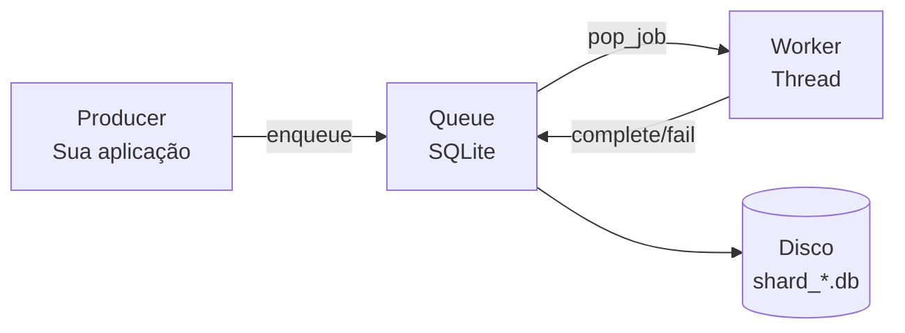
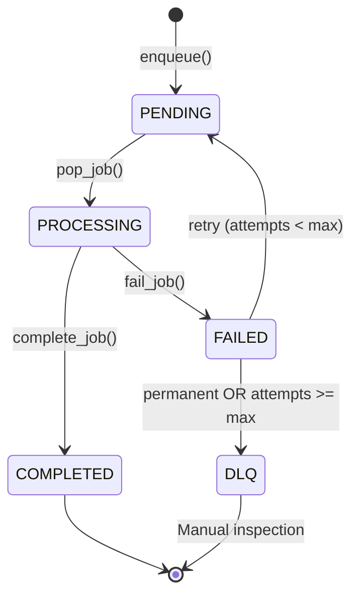
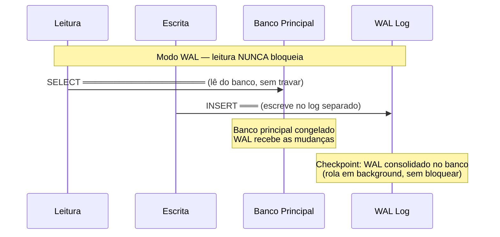
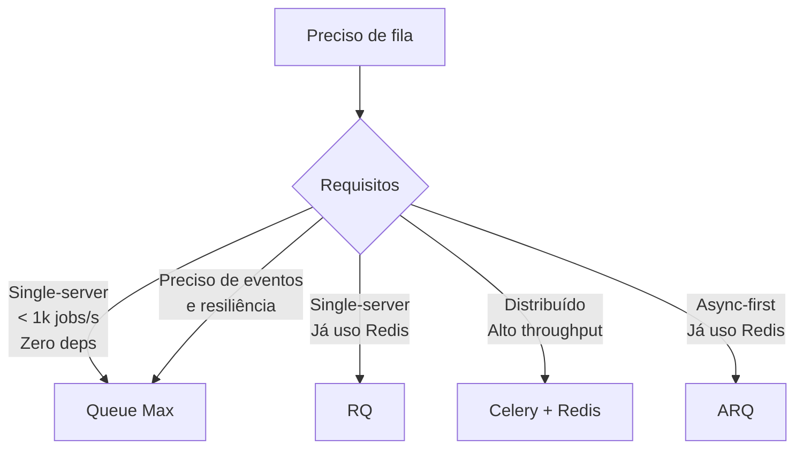

# Queue Max — O Livro

> **Uma jornada didática pelo design de sistemas, concorrência, bancos de dados
> e Python através da construção de uma task queue.**

---

## Prefácio

Este livro nasceu de uma necessidade prática: a maioria dos tutoriais sobre
filas de tarefas pula direto pro "use Redis, use Celery", sem explicar
o que está acontecendo por baixo. Queue Max é o oposto — ele resolve o
problema **sem Redis**, e ao fazê-lo, expõe todos os conceitos que
normalmente ficam escondidos atrás de uma abstração.

Ao final deste livro, você será capaz de:

- Projetar sistemas com filas de tarefas
- Trabalhar com concorrência em Python com segurança
- Usar SQLite além do "banco de brinquedo"
- Implementar rate limiting, circuit breaker e retry do zero
- Debugar problemas de produção em sistemas concorrentes
- Tomar decisões de design informadas (e defender suas escolhas)

---

## Sumário

### Parte I: Fundações
1. [O Que é uma Fila de Tarefas?](#1-o-que-é-uma-fila-de-tarefas)
2. [Por que Não Redis?](#2-por-que-não-redis)
3. [SQLite para Filas](#3-sqlite-para-filas)
4. [Concorrência em Python](#4-concorrência-em-python)

### Parte II: Construindo o Núcleo
5. [A Classe Queue](#5-a-classe-queue)
6. [O ShardManager](#6-o-shardmanager)
7. [O Schema e as Transações](#7-o-schema-e-as-transações)
8. [Sharding Físico](#8-sharding-físico)
9. [O Worker](#9-o-worker)

### Parte III: Resiliência
10. [Rate Limiting — Token Bucket](#10-rate-limiting--token-bucket)
11. [Circuit Breaker](#11-circuit-breaker)
12. [Retry com Backoff](#12-retry-com-backoff)
13. [Dead Letter Queue](#13-dead-letter-queue)
14. [Orphan Recovery](#14-orphan-recovery)

### Parte IV: API e Usabilidade
15. [O Decorator @task](#15-o-decorator-task)
16. [Sistema de Eventos](#16-sistema-de-eventos)
17. [Eventos Tipados com bubus](#17-eventos-tipados-com-bubus)
18. [CLI com Argparse](#18-cli-com-argparse)
19. [Integrações Django, FastAPI, Flask](#19-integrações-django-fastapi-flask)

### Parte V: Produção
20. [Debugging e Troubleshooting](#20-debugging-e-troubleshooting)
21. [Testes](#21-testes)
22. [Performance](#22-performance)
23. [Armadilhas e Erros Comuns](#23-armadilhas-e-erros-comuns)

### Parte VI: Design e Arquitetura
24. [Padrões de Projeto no Queue Max](#24-padrões-de-projeto-no-queue-max)
25. [Decisões de Design](#25-decisões-de-design)
26. [O Roadmap](#26-o-roadmap)

### Parte VII: Projeto Final
27. [Construa Sua Própria Fila](#27-construa-sua-própria-fila)
28. [Exercícios Completos com Resolução](#28-exercícios-completos-com-resolução)

### Apêndices
A. [Glossário](#apêndice-a-glossário)
B. [Referência da API](#apêndice-b-referência-da-api)
C. [Como Ler o Código Fonte](#apêndice-c-como-ler-o-código-fonte)
D. [Comparação com Alternativas](#apêndice-d-comparação-com-alternativas)
E. [Cheat Sheet](#apêndice-e-cheat-sheet)

---

# Parte I: Fundações

> Antes de construir uma fila, precisamos entender o que é uma fila,
> por que ela existe, e quais ferramentas temos à disposição.

---

## 1. O Que é uma Fila de Tarefas?

**Objetivos de Aprendizagem:**
- ✅ Explicar o problema que filas de tarefas resolvem
- ✅ Diferenciar processamento síncrono de assíncrono
- ✅ Descrever os 3 papéis: Producer, Queue, Worker
- ✅ Mapear o ciclo de vida de um job
- ✅ Listar os requisitos mínimos de uma task queue

### 1.1 O Problema Fundamental

Imagine que você está no balcão de uma padaria. Chega um cliente e
pede um pão francês. Você dá o pão em 5 segundos. Cliente feliz.

Agora imagine que o mesmo cliente pede **um bolo de cenoura**. Fazer
um bolo leva 40 minutos. O cliente vai esperar 40 minutos no balcão?

Não. Você anota o pedido, coloca numa **fila de pedidos**, e diz:
"Fica pronto em 40 minutos, eu aviso."

Essa é a essência de uma **fila de tarefas (task queue)**:

```
Requisição Síncrona (sem fila):
Cliente ──► Fazer Bolo (40 min) ──► Resposta
           ████████████████████████████ ← cliente esperando

Requisição Assíncrona (com fila):
Cliente ──► Anotar Pedido (2s) ──► "Já já" ──► [FILA] ──► Fazer Bolo
           ██ ← cliente já foi embora                         (40 min depois)
```

A diferença: com fila, o cliente não espera. O pedido é processado
em background.

### 1.2 Traduzindo pra Código

Sem fila (síncrono):

```python
@app.post("/send-email")
def send_email(to: str):
    smtp.connect("smtp.gmail.com", 587)    # 200ms
    smtp.login("user", "pass")              # 300ms
    smtp.send(to, "Bem-vindo!")             # 500ms
    smtp.close()                            # 100ms
    return {"status": "sent"}               # ← 1.1 SEGUNDOS DEPOIS
```

O usuário espera 1.1 segundos pela resposta. Péssima experiência.

Com fila (assíncrono):

```python
@app.post("/send-email")
def send_email(to: str):
    queue.enqueue({
        "task": "send_welcome",
        "to": to,
        "template": "welcome"
    })                                      # 2ms
    return {"status": "accepted"}           # ← 2 MILISSEGUNDOS DEPOIS
```

O usuário recebe resposta em 2ms. O email é enviado em background.

### 1.3 Os Três Papéis

Toda task queue tem três atores:



**Producer**: Sua aplicação web. Cria jobs quando algo precisa ser
processado (enviar email, gerar relatório, processar pagamento).

**Queue**: O "armazém" de jobs. Guarda, ordena, e entrega jobs aos
workers. Precisa ser persistente (se o servidor reiniciar, os jobs
não podem sumir).

**Worker**: Processa os jobs em loop infinito. Roda em background,
geralmente em threads separadas ou processos separados.

### 1.4 O Ciclo de Vida de um Job



1. **PENDING**: Job acabou de ser enfileirado. Aguardando worker.
2. **PROCESSING**: Worker pegou o job. Está executando agora.
3. **COMPLETED**: Job processado com sucesso. Removido da fila.
4. **FAILED**: Job falhou. Se ainda tem tentativas, vai pra RETRY.
   Se esgotou ou é erro permanente, vai pra DLQ.
5. **DLQ**: Dead Letter Queue. Jobs que falharam permanentemente,
   guardados para inspeção manual.

### 1.5 O Que Toda Task Queue Precisa Ter

| Requisito | Por quê |
|-----------|---------|
| **Persistência** | Jobs não podem sumir se o servidor reiniciar |
| **Ordenação** | Jobs devem ser processados em ordem (ou pelo menos FIFO por prioridade) |
| **Concorrência segura** | Dois workers não podem pegar o mesmo job |
| **Retry** | Falhas de rede são temporárias |
| **Monitoramento** | Ver quantos jobs estão pendentes, processando, falhos |

### 1.6 O Queue Max Numa Frase

Queue Max é uma task queue que usa **SQLite** como backend (zero
dependências), com **sharding** (múltiplos arquivos), **rate limiting**,
**circuit breaker**, **retry**, e **CLI** — tudo em Python puro.

### ✅ Checkpoint: Você Entendeu?

1. Qual a diferença entre processamento síncrono e assíncrono?
2. Quais são os 3 papéis em uma task queue?
3. O que acontece com um job depois que o worker termina de processá-lo?
4. Por que persistência é importante em uma fila de tarefas?

> **Respostas** no final do capítulo.

---

#### 📚 Resumo do Capítulo 1

- **Fila de tarefas** separa a criação da execução do trabalho
- Producer cria jobs, Queue armazena, Worker processa
- Job passa por: PENDING → PROCESSING → COMPLETED ou FAILED/DLQ
- Toda fila precisa ser persistente, ordenada, concorrente e monitorável

---

#### Respostas do Checkpoint

1. **Síncrono**: quem cria espera o resultado. **Assíncrono**: quem cria
   recebe "aceito" e o processamento acontece depois.
2. **Producer** (cria), **Queue** (armazena), **Worker** (processa).
3. Se sucesso: `complete_job()` remove da fila. Se falha: `fail_job()`
   decide entre retry ou DLQ.
4. Se o servidor reiniciar, os jobs na memória são perdidos. Com
   persistência em disco, eles sobrevivem.

---

## 2. Por que Não Redis?

**Objetivos de Aprendizagem:**
- ✅ Entender o custo operacional do Redis
- ✅ Conhecer as vantagens do SQLite como backend de fila
- ✅ Saber quando cada tecnologia é apropriada
- ✅ Identificar cenários onde Queue Max não é a melhor escolha

### 2.1 O Lugar do Redis

Redis é um banco chave-valor em memória. É excelente para:

- Cache (páginas, sessões, resultados de query)
- Rate limiting (INCR + EXPIRE)
- Pub/sub (mensagens em tempo real)
- Leaderboards (sorted sets)

Ele também é usado para filas. Muitas bibliotecas usam Redis como
backend de fila: RQ, Celery (com Redis broker), ARQ.

### 2.2 O Custo do Redis

Redis não é gratuito. O custo não é financeiro (é open source), mas
operacional:

```
Setup:
  apt install redis-server        # 1 comando
  systemctl enable redis          # mais 1 comando
  systemctl start redis           # mais 1 comando

Configuração:
  redis.conf: bind, requirepass, maxmemory, save, ...
  # quantas linhas tem seu redis.conf? 50? 100? 500?

Manutenção:
  - Monitorar uso de memória
  - Configurar persistência (RDB, AOF)
  - Gerenciar conexões (maxclients)
  - Backup e restore
  - Atualizações de segurança

Falhas:
  - Redis caiu? Sua fila parou.
  - Redis sem persistência? Jobs perdidos no restart.
```

### 2.3 A Alternativa Esquecida

SQLite está **em todo lugar**:

- Está instalado em todo Python (`import sqlite3`)
- Não precisa de servidor (é embutido)
- Não precisa de configuração
- Não precisa de manutenção
- Os dados estão em **arquivos** — você pode fazer backup com `cp`
- É um banco relacional completo (SQL, índices, transações, triggers)

O que SQLite não é: um banco cliente-servidor. Ele não serve para
acesso concorrente de **múltiplos servidores**. Mas para uma fila
local (single-server), é mais que suficiente.

### 2.4 Quando Usar Cada Um

```
                Redis
                  │
                  │ 10.000+ jobs/s
                  │ Multi-server
                  │ Já usa Redis na stack
                  │
    ──────────────┼──────────────────
                  │
                  │ < 1.000 jobs/s
                  │ Single-server
                  │ Zero dependências
                  │
               SQLite (Queue Max)
```

A pergunta que você deve fazer: **"Meu projeto precisa de 10.000 jobs
por segundo ou 100 jobs por segundo?"**

Se a resposta for 100 jobs/s (e é pra maioria dos projetos), SQLite
resolve sem precisar de Redis.

### 2.5 Quando Queue Max Não Serve

Seja honesto: Queue Max não é bala de prata. Ele não serve para:

- **Multi-server**: Se você tem 5 servidores processando jobs, precisa
  de um backend compartilhado (Redis, RabbitMQ, PostgreSQL)
- **Altíssimo throughput**: > 10.000 jobs/s, o SQLite vira gargalo
- **Jobs CPU-bound**: Threads não paralelizam CPU em Python (GIL)

Para esses casos, use Celery + Redis/RabbitMQ ou Kafka.

### ✅ Checkpoint: Você Entendeu?

1. Quais os custos operacionais de adicionar Redis à sua stack?
2. Em que cenário SQLite ganha de Redis para filas?
3. Quando Queue Max **não** é a escolha certa?

#### 📚 Resumo do Capítulo 2

- Redis tem custo operacional (instalação, configuração, manutenção)
- SQLite está embutido no Python — zero dependências
- Queue Max cobre 90% dos casos sem Redis
- Para >10k jobs/s ou multi-server, Redis/Celery são necessários

---

#### Respostas do Checkpoint

1. Instalação, configuração, monitoramento de memória, persistência,
   backup, atualizações. Um serviço inteiro pra gerenciar.
2. Quando o projeto é single-server e <1k jobs/s. SQLite elimina
   a complexidade operacional do Redis.
3. Multi-server, >10k jobs/s, jobs CPU-bound, filas distribuídas.

---

## 3. SQLite para Filas

**Objetivos de Aprendizagem:**
- ✅ Compreender por que SQLite é suficiente para filas
- ✅ Explicar WAL mode e seus benefícios para concorrência
- ✅ Entender o papel do busy_timeout
- ✅ Diferenciar sharding lógico de físico

### 3.1 SQLite Não é "SQL de Brinquedo"

Muita gente trata SQLite como um banco "menor". A realidade:

- **Testado**: Bilhões de cópias em produção (todo iPhone, todo Android,
  Chrome, Firefox, Photoshop, Skype...)
- **Confiável**: Transações ACID, rollback, WAL mode
- **Rápido**: Operações simples em ~microssegundos (contra ~milissegundos
  de um banco cliente-servidor)
- **Capaz**: Suporta bancos de até 281 TB, colunas até 1 bilhão de linhas

O que SQLite NÃO é: escalável horizontalmente. Um arquivo .db está
preso a uma máquina. Mas pra uma fila local, isso não é problema.

### 3.2 WAL Mode — A Chave da Concorrência

O modo padrão do SQLite é **journal mode DELETE** (ou ROLLBACK). Nesse
modo, uma transação de escrita bloqueia TODAS as leituras e vice-versa:

```
journal=DELETE:

[LEITURA 1 ═══════╗
[ESCRITA 1 ═════╗ ║
                 ║ ║  ← TUDO bloqueado
                 ╚═╝
```

Com **WAL (Write-Ahead Log)**, as escritas vão para um log separado.
Leituras continuam lendo do banco principal (que não muda durante a
escrita):



Quando a escrita é commitada, os leitores que começarem depois veem
a mudança. Leitores existentes continuam vendo a versão antiga até
terminarem. Esse mecanismo se chama **snapshot isolation**.

**No Queue Max**:

```python
PRAGMA journal_mode = WAL;  # ← ativado em toda conexão
```

### 3.3 busy_timeout — Evitando "database is locked"

Quando dois processos/threads tentam escrever no mesmo .db ao mesmo
tempo, SQLite precisa serializar (só um escreve por vez). Sem timeout,
o perdedor recebe erro imediatamente:

```
Sem busy_timeout:
  Thread A: BEGIN IMMEDIATE → LOCK ✓
  Thread B: BEGIN IMMEDIATE → LOCK ✗ "database is locked"

Com busy_timeout=30000:
  Thread A: BEGIN IMMEDIATE → LOCK ✓
  Thread B: BEGIN IMMEDIATE → ESPERA... (até 30s)
  Thread A: COMMIT → libera
  Thread B: → LOCK ✓ (conseguiu!)
```

O `busy_timeout` converte "erro fatal" em "espera educada". O Queue
Max usa 30 segundos por padrão:

```python
PRAGMA busy_timeout = 30000;  # 30 segundos
```

### 3.4 Por que Não Usar Só Um Arquivo?

Com um único `queue.db`, todos os workers competem pelo mesmo lock:

```
6 workers, 1 arquivo:

worker 1: ████████ INSERT ═══╗
worker 2: ████████ INSERT ═══╣ ESPERAM
worker 3: ████████ INSERT ═══╣
worker 4: ████████ INSERT ═══╣
worker 5: ████████ INSERT ═══╣
worker 6: ████████ INSERT ═══╝
          └──────── 1 por vez ────────► gargalo!
```

Solução: múltiplos arquivos (shards). Cada shard é independente:

```
6 workers, 6 arquivos:

worker 1: ████████ INSERT em shard_0.db  ← sem competição!
worker 2: ████████ INSERT em shard_1.db
worker 3: ████████ INSERT em shard_2.db
worker 4: ████████ INSERT em shard_3.db
worker 5: ▾ ████████ INSERT em shard_4.db
worker 6: ████████ INSERT em shard_5.db
          └── todos ao mesmo tempo!
```

Isso se chama **sharding físico**. É o diferencial mais importante
do Queue Max vs uma fila SQLite simples.

### 3.5 O Preço do Sharding

Sharding não é de graça. O preço:

1. **Coordenação**: Quando um worker faz `pop_job()`, ele não sabe
   em qual shard tem job. Ele precisa **procurar**.
2. **Ordenação global**: Não existe. Jobs do shard 0 e shard 1 não
   têm ordem relativa garantida.
3. **Complexidade**: Mais código, mais arquivos, mais conexões.

O Queue Max mitiga #1 com `ShardGroup` (agrupamento otimizado de
shards para busca).

### ✅ Checkpoint: Você Entendeu?

1. O que é WAL mode e por que ele é essencial para filas?
2. O que `busy_timeout` faz? O que acontece sem ele?
3. Qual a diferença entre sharding lógico e físico?

#### 📚 Resumo do Capítulo 3

- SQLite não é banco de brinquedo — é ACID, testado, usado em bilhões
  de dispositivos
- WAL mode permite leitura e escrita simultâneas
- `busy_timeout` converte "database is locked" em "espera educada"
- Sharding físico (N arquivos) > sharding lógico (1 arquivo com WHERE)

---

#### Respostas do Checkpoint

1. WAL (Write-Ahead Log) permite que leituras aconteçam sem bloquear
   escritas. Sem WAL, toda operação serializa.
2. `busy_timeout` diz ao SQLite "espere N ms antes de desistir". Sem
   ele, contenção retorna erro imediato.
3. **Lógico**: 1 arquivo, `WHERE shard_id = ?`. **Físico**: N arquivos,
   cada um independente. Físico elimina contenção de lock.

---

## 4. Concorrência em Python

**Objetivos de Aprendizagem:**
- ✅ Diferenciar threads, processos e async
- ✅ Explicar o GIL e seus efeitos práticos
- ✅ Usar `threading.Lock()` e `threading.Event()` corretamente
- ✅ Entender thread-local storage

### 4.1 Thread, Processo, Async — Qual a Diferença?

Python oferece três modelos de concorrência:

```
          ┌──────────┐
          │ Processo │  ← isolado: memória própria
          │  (fork)  │     pesado: ~50MB cada
          └──────────┘     comunicação: pipe/socket/queue

          ┌──────────┐
          │  Thread  │  ← compartilhado: mesma memória
          │          │     leve: ~8KB cada
          └──────────┘     GIL: só um executa Python por vez

          ┌──────────┐
          │  Async   │  ← cooperativo: um thread só
          │ (asyncio)│     levíssimo: milhares de "tarefas"
          └──────────┘     I/O-bound: excelente
                          CPU-bound: não ajuda
```

Queue Max usa **threads**. Por quê?

- Processos são pesados demais para workers (cada worker precisaria
  de ~50MB de RAM)
- Async não funciona com código bloqueante (e a maioria das funções
  de processamento faz I/O bloqueante: requests.get, smtp.send, etc.)
- Threads são o meio termo: leves o suficiente, compartilham memória,
  e liberam o GIL durante I/O

### 4.2 O GIL Explicado de Uma Vez

O GIL (Global Interpreter Lock) é o mecanismo que impede que duas
threads Python executem **bytecode** ao mesmo tempo:

```
Thread A: ████ EXECUTA ████ ESPERA I/O ████ EXECUTA ████
Thread B: ESPERA ████ EXECUTA ████ ESPERA I/O ████ EXECUTA
          └── só 1 executa por vez ──┘
```

Isso significa que threads **não paralelizam CPU**. Se sua função de
processamento faz `for i in range(10_000_000): math.sqrt(i)`, ter
2 workers não vai ser mais rápido que 1.

**Mas** se sua função faz `requests.get(url)` (I/O de rede), o GIL
é liberado durante a espera:

```
Thread A: EXECUTA │ requests.get(url) │ EXECUTA
Thread B: EXECUTA │ requests.get(url) │ EXECUTA
          └── AMBAS EXECUTAM ← o GIL foi liberado no I/O
```

A maioria das tarefas de fila é I/O-bound (chamar API, enviar email,
processar arquivo). Por isso threads funcionam bem.

### 4.3 Thread Safety — O Básico

Quando duas threads acessam a mesma variável ao mesmo tempo, o
resultado é imprevisível:

```python
# Código PROBLEMÁTICO
contador = 0

def incrementar():
    global contador
    contador += 1   # ← NÃO é atômico!
    # Internamente:
    # 1. LER contador (ex: 5)
    # 2. SOMAR 1 (5 + 1 = 6)
    # 3. ESCREVER contador = 6
    # Se outra thread fizer o mesmo entre 1 e 3, perdemos um incremento

threads = [Thread(target=incrementar) for _ in range(100)]
for t in threads: t.start()
for t in threads: t.join()
print(contador)  # ← NÃO é 100! Pode ser 97, 98, 99...
```

**Solução**: `threading.Lock()` (mutex):

```python
lock = threading.Lock()
contador = 0

def incrementar():
    global contador
    with lock:       # ← só 1 thread por vez aqui
        contador += 1

threads = [Thread(target=incrementar) for _ in range(100)]
for t in threads: t.start()
for t in threads: t.join()
print(contador)  # ← SEMPRE 100 ✅
```

### 4.4 Eventos — Comunicação Entre Threads

`threading.Event` é a forma mais segura de uma thread dizer pra outra
"pode parar":

```python
stop_event = threading.Event()

def worker():
    while not stop_event.is_set():  # ← pergunta "devo parar?"
        print("trabalhando...")
        time.sleep(1)

t = Thread(target=worker, daemon=True)
t.start()

time.sleep(5)
stop_event.set()  # ← "pode parar agora"
t.join()           # ← espera thread terminar
```

Sem `Event`, você teria que usar uma variável global com lock:

```python
# ❌ COMPLICADO e propenso a erro
running = True
running_lock = threading.Lock()

def worker():
    global running
    while True:
        with running_lock:
            if not running:
                break
        ...

# ✅ SIMPLES com Event
stop = threading.Event()
def worker():
    while not stop.is_set():
        ...
```

### 4.5 Thread-Local Storage

Cada thread pode ter seus próprios dados, isolados das outras:

```python
dados = threading.local()  # ← cada thread tem sua CÓPIA

def worker():
    dados.user_id = threading.current_thread().name  # ← só esta thread vê
    print(dados.user_id)  # ← seguro, não precisa de lock

Thread(target=worker, name="A").start()  # imprime "A"
Thread(target=worker, name="B").start()  # imprime "B"
```

Queue Max usa isso para conexões SQLite:

```python
self._local = threading.local()

def _get_connection(self, shard_id):
    if not hasattr(self._local, "connections"):
        self._local.connections = {}
    if shard_id not in self._local.connections:
        conn = sqlite3.connect(...)
        self._local.connections[shard_id] = conn
    return self._local.connections[shard_id]
```

Cada thread cria suas próprias conexões. Sem lock. Sem compartilhar
objetos `Connection` entre threads (o que não é thread-safe).

### ✅ Checkpoint: Você Entendeu?

1. Por que threads funcionam bem para filas mesmo com o GIL?
2. Qual a diferença entre `threading.Lock()` e `threading.Event()`?
3. Quando usar AsyncWorker em vez de Worker?

#### 📚 Resumo do Capítulo 4

- Threads são leves (~8KB) e compartilham memória
- GIL só é problema para CPU-bound; I/O libera o GIL
- `Lock()` protege seções críticas; `Event()` sinaliza entre threads
- Thread-local storage evita compartilhar objetos não thread-safe

---

#### Respostas do Checkpoint

1. A maioria das tarefas de fila é I/O-bound (chamar API, enviar email).
   Durante I/O, o GIL é liberado e outras threads executam.
2. `Lock()` = "só 1 por vez" (exclusão mútua). `Event()` = "avise
   quando puder parar" (comunicação).
3. Use AsyncWorker se sua `process_function` é async (tem `await`).
   Para funções síncronas, Worker é mais simples e eficiente.

---

> Agora que entendemos os conceitos, vamos construir o coração do
> Queue Max: a Queue, o ShardManager, as transações e o Worker.

---

## 5. A Classe Queue

### 5.1 A API Pública

A classe `Queue` é a porta de entrada. O usuário interage com ela:

```python
from queue_max import Queue

queue = Queue(shards=6, rate_limit=160)
queue.enqueue({"task": "send_email", "to": "user@example.com"})
job = queue.pop_job("worker-1")
queue.complete_job(job.id, job.shard_id)
```

Tudo que o usuário precisa está aqui. A complexidade (SQLite, shards,
transações, locks) fica escondida.

### 5.2 O Que a Queue Guarda

```python
class Queue:
    def __init__(self, shards=None, rate_limit=None, max_retries=None, ...):
        # Shards
        self.num_shards = shards or 6
        self.shard_manager = ShardManager(self.num_shards, self.data_dir)
        self._shard_locks = [threading.Lock() for _ in range(self.num_shards)]
        self._shard_groups = ShardGroup(self.num_shards)

        # Controles
        self.rate_limiter = RateLimiter(rate_limit or 160)
        self.circuit_breaker = CircuitBreaker(...)

        # Eventos
        self._events = {"job_enqueued": [], "job_completed": [], ...}
        self._events_lock = threading.Lock()
```

Cada componente tem uma responsabilidade única:

| Componente | Responsabilidade |
|------------|-----------------|
| `ShardManager` | Operações SQLite em todos os shards |
| `RateLimiter` | Controlar taxa de processamento |
| `CircuitBreaker` | Proteger contra falhas em cascata |
| `_shard_locks` | Impedir double-claim por shard (dentro do processo) |
| `_shard_groups` | Otimizar busca de jobs entre shards |
| `_events` | Notificar listeners sobre mudanças |

### 5.3 O Fluxo do enqueue

```python
def enqueue(self, payload, pagina_id=None, priority=0, max_retries=None):
    # 1. Validações
    payload = validate_payload(payload)      # é dict? é serializável?
    priority = validate_priority(priority)    # é 0, 1 ou 2?

    # 2. Roteamento
    # (usando pagina_id % num_shards ou aleatório)
    shard_id = determine_shard(pagina_id, self.num_shards)

    # 3. Inserção no banco
    job_id = self.shard_manager.insert_job(
        shard_id, payload, pagina_id, priority, max_retries
    )

    # 4. Notificação
    self._emit("job_enqueued", job_id=job_id, shard_id=shard_id)

    # 5. Alerta se fila estiver grande
    if pending > alert_threshold:
        self._emit("alert", type="QUEUE_SIZE", pending=pending, ...)

    return {"id": job_id, "shard_id": shard_id}
```

Passo a passo:

1. **Valida**: payload precisa ser dict JSON-serializável. Prioridade
   precisa ser 0, 1 ou 2. Se não, erro na hora (fail fast).
2. **Roteia**: escolhe qual shard (`pagina_id % num_shards` ou sorteio).
3. **Insere**: `INSERT INTO fila (payload, ...) VALUES (?, ...)`.
4. **Notifica**: quem estiver ouvindo o evento "job_enqueued" é chamado.
5. **Alerta**: se tem mais de 1000 jobs pendentes, dispara alerta.

### 5.4 O Fluxo do pop_job — O Coração do Sistema

```python
def pop_job(self, worker_id):
    # 1. Rate limiter
    try:
        self.rate_limiter.acquire(timeout=self.rate_limiter_timeout)
    except RateLimitError:
        return None  # ← muitas requisições, espera

    # 2. Circuit breaker
    if not self.circuit_breaker.is_allowed():
        return None  # ← serviço externo pode estar fora

    # 3. Busca nos shards (otimizada por ShardGroup)
    groups = self._shard_groups.randomized_groups()

    # Fast path (1 grupo só — ≤4 shards)
    if len(groups) == 1:
        for shard_id in shuffled(groups[0]):
            with self._shard_locks[shard_id]:
                job = self.shard_manager.pop_job(shard_id, worker_id)
                if job: return job
        return None

    # Multi-group path
    for group in groups:
        for shard_id in shuffled(group):
            with self._shard_locks[shard_id]:
                job = self.shard_manager.pop_job(shard_id, worker_id)
                if job: return job
    return None
```

Três proteções em cascata:

1. **Rate limiter**: Não deixa o worker processar mais que o limite
   (protege API externa).
2. **Circuit breaker**: Se o serviço está fora, nem tenta (economiza
   recursos).
3. **Shard lock**: Só um worker por vez por shard (evita double-claim).

### 5.5 complete_job e fail_job

```python
def complete_job(self, job_id, shard_id):
    self.shard_manager.complete_job(shard_id, job_id)
    self.circuit_breaker.record_success()   # ← reset de falhas
    self._emit("job_completed", job_id=job_id, shard_id=shard_id)

def fail_job(self, job_id, shard_id, error, permanent=False):
    self.shard_manager.fail_job(shard_id, job_id, error, permanent)
    self.circuit_breaker.record_failure()   # ← acumula falha
    event = "job_failed" if permanent else "job_retried"
    self._emit(event, job_id=job_id, shard_id=shard_id, error=str(error))
```

Repare: `complete_job` chama `record_success()` (reseta o contador de
falhas do circuit breaker). `fail_job` chama `record_failure()` (se
acumular 5, o circuit breaker abre).

---

## 6. O ShardManager

### 6.1 Por que Existe

Separação de responsabilidades:

- `Queue` → orquestra (valida, roteia, notifica, protege)
- `ShardManager` → executa SQL (insere, seleciona, atualiza, deleta)

A `Queue` não sabe de SQLite. Ela chama `shard_manager.insert_job()`
e acabou. Se um dia trocar SQLite por PostgreSQL, só muda o
`ShardManager`.

### 6.2 Gerenciamento de Conexões

```python
class ShardManager:
    def __init__(self, num_shards, data_dir):
        self.num_shards = num_shards
        self.data_dir = data_dir
        self._local = threading.local()        # ← conexões por thread
        self._all_connections = set()           # ← rastreio global
        self._connections_lock = threading.Lock()
        os.makedirs(data_dir, exist_ok=True)

        # Inicializa todos os shards (cria DB, schema)
        for shard_id in range(num_shards):
            self._init_shard(shard_id)

    def _init_shard(self, shard_id):
        db_path = os.path.join(self.data_dir, f"shard_{shard_id}.db")
        is_new = not os.path.exists(db_path)
        conn = sqlite3.connect(db_path)
        for pragma in PRAGMAS_SQL:
            conn.execute(pragma)         # WAL, busy_timeout, etc.
        conn.executescript(SCHEMA_SQL)   # CREATE TABLEs
        for index in INDEXES_SQL:
            conn.execute(index)          # CREATE INDEX
        conn.commit()
        conn.close()
```

Cada shard é um arquivo `.db` separado. Na inicialização, todos são
criados com schema e índices.

### 6.3 A Conexão Thread-Local

```python
def _get_connection(self, shard_id):
    # Cada thread tem seu cache de conexões
    if not hasattr(self._local, "connections"):
        self._local.connections = {}
    if shard_id not in self._local.connections:
        db_path = os.path.join(self.data_dir, f"shard_{shard_id}.db")
        conn = sqlite3.connect(db_path, timeout=DB_BUSY_TIMEOUT/1000)
        conn.row_factory = sqlite3.Row
        for pragma in PRAGMAS_SQL:
            conn.execute(pragma)
        self._local.connections[shard_id] = conn
        # Rastreia pra poder fechar depois
        with self._connections_lock:
            self._all_connections.add(conn)
    return self._local.connections[shard_id]
```

**Por que thread-local?** Objetos `sqlite3.Connection` não são
thread-safe. Se duas threads compartilham a mesma conexão, pode
corromper o banco. Com thread-local, cada thread tem sua própria
conexão, e SQLite gerencia a concorrência no nível do arquivo
(busy_timeout + WAL).

### 6.4 Fechando Conexões

```python
def close_all(self):
    with self._connections_lock:
        for conn in list(self._all_connections):
            try:
                conn.close()
            except Exception:
                pass
        self._all_connections.clear()
    if hasattr(self._local, "connections"):
        self._local.connections.clear()
```

Fecha TUDO. Usado no shutdown da Queue. Depois de `close_all()`,
as conexões das outras threads se tornam inválidas, mas SQLite
lida com isso graciosamente (o garbage collector fecha quando
o objeto é destruído).

---

## 7. O Schema e as Transações

### 7.1 A Tabela Principal

```sql
CREATE TABLE fila (
    id INTEGER PRIMARY KEY AUTOINCREMENT,
    pagina_id INTEGER NULL,
    payload TEXT NOT NULL,
    status TEXT DEFAULT 'pending',
    priority INTEGER DEFAULT 0,
    tentativas INTEGER DEFAULT 0,
    max_tentativas INTEGER DEFAULT 3,
    retry_delay INTEGER DEFAULT 60,
    last_error TEXT NULL,
    error_type TEXT NULL,
    error_stack TEXT NULL,
    worker_id TEXT NULL,
    heartbeat TEXT NULL,
    created_at TEXT DEFAULT (datetime('now')),
    started_at TEXT NULL,
    completed_at TEXT NULL,
    next_retry_at TEXT NULL
);
```

Cada coluna tem uma função:

| Coluna | Função |
|--------|--------|
| `id` | Identificador único, auto-incremento |
| `pagina_id` | ID externo para sharding consistente |
| `payload` | Dados do job (JSON) |
| `status` | pending, processing, failed |
| `priority` | 0 (baixa), 1 (média), 2 (alta) |
| `tentativas` | Quantas vezes tentou processar |
| `max_tentativas` | Máximo de tentativas antes da DLQ |
| `retry_delay` | Delay base para backoff |
| `last_error` | Última mensagem de erro |
| `error_type` | Classe do erro (ex: ConnectionError) |
| `error_stack` | Stack trace completo |
| `worker_id` | Quem está processando agora |
| `heartbeat` | Último sinal de vida do worker |
| `next_retry_at` | Quando tentar de novo (retry) |

### 7.2 A Tabela de Metadados

```sql
CREATE TABLE shard_metadata (
    shard_id INTEGER PRIMARY KEY,
    version INTEGER DEFAULT 1,
    created_at TEXT DEFAULT (datetime('now')),
    last_vacuum TEXT NULL,
    total_jobs_processed INTEGER DEFAULT 0,
    total_jobs_failed INTEGER DEFAULT 0
);
```

Um registro por shard. Guarda:
- Quando foi criado
- Quantos jobs já processou (contador)
- Quantos jobs falharam
- Quando foi o último VACUUM

### 7.3 A Dead Letter Queue

```sql
CREATE TABLE dead_letter_queue (
    id INTEGER PRIMARY KEY AUTOINCREMENT,
    original_job_id INTEGER,
    payload TEXT NOT NULL,
    error TEXT NOT NULL,
    error_type TEXT NOT NULL,
    failed_at TEXT DEFAULT (datetime('now')),
    shard_id INTEGER
);
```

Jobs que falharam permanentemente (esgotaram tentativas ou erro
permanente). Guarda tudo pra debugging: payload original, erro,
quando aconteceu.

### 7.4 Os Índices

```sql
CREATE INDEX idx_status_priority ON fila(status, priority DESC);
CREATE INDEX idx_next_retry ON fila(next_retry_at) WHERE status = 'pending';
CREATE INDEX idx_heartbeat ON fila(heartbeat) WHERE status = 'processing';
CREATE INDEX idx_created_at ON fila(created_at);
CREATE INDEX idx_status_created ON fila(status, created_at);
CREATE INDEX idx_dlq_failed_at ON dead_letter_queue(failed_at);
```

Cada índice tem um propósito:

- `status_priority`: encontrar o próximo job a processar (mais prioritário
  e mais antigo) — é o índice mais importante, usado em todo pop_job
- `next_retry`: encontrar jobs que venceram o retry e podem ser
  processados de novo — é um índice **parcial** (só inclui `pending`),
  mais eficiente
- `heartbeat`: encontrar jobs órfãos (processing mas sem heartbeat
  recente) — também parcial
- `created_at`: ordenar e limpar jobs antigos
- `status_created`: consultas por status
- `dlq_failed_at`: ordenar DLQ por data

### 7.5 A Transação do pop_job

```python
def pop_job(self, shard_id, worker_id):
    conn = self._get_connection(shard_id)
    now = now_iso()
    try:
        # 1. Lock de escrita (ninguém mais escreve neste shard)
        conn.execute("BEGIN IMMEDIATE")

        # 2. SELECT do próximo job disponível
        row = conn.execute("""
            SELECT * FROM fila
            WHERE status='pending'
              AND (next_retry_at IS NULL OR next_retry_at<=?)
            ORDER BY priority DESC, id ASC
            LIMIT 1
        """, (now,)).fetchone()

        if row is None:
            conn.commit()
            return None

        # 3. UPDATE concorrencial
        # Só atualiza SE ainda está pending (outro worker não pegou)
        cur = conn.execute("""
            UPDATE fila SET
                status='processing',
                worker_id=?,
                heartbeat=?,
                started_at=?
            WHERE id=? AND status='pending'
        """, (worker_id, now, now, row["id"]))

        conn.commit()  # libera lock

        if cur.rowcount == 0:
            return None  # outro worker pegou antes

        job = Job.from_row(dict(row), shard_id=shard_id)
        job.status = JobStatus.PROCESSING
        return job

    except sqlite3.OperationalError as e:
        logger.warning("pop_job shard %d: %s", shard_id, e)
        conn.rollback()
        return None
```

**Por que SELECT + UPDATE e não UPDATE + RETURNING?**

`UPDATE ... RETURNING` é suportado no SQLite 3.35+ (2021). O Queue
Max suporta Python 3.9+, que pode usar SQLite 3.31 (Ubuntu 20.04).
Para compatibilidade máxima, SELECT primeiro, UPDATE depois.

**O WHERE status='pending' no UPDATE é essencial.**

Sem ele:
```
Worker A: SELECT → acha job 42
Worker B: SELECT → acha job 42 (antes do UPDATE do A)
Worker A: UPDATE fila SET status='processing' WHERE id=42 → OK
Worker B: UPDATE fila SET status='processing' WHERE id=42 → OK TAMBÉM!
```

Com ele:
```
Worker A: SELECT → acha job 42
Worker A: UPDATE ... WHERE id=42 AND status='pending' → OK (rowcount=1)
Worker B: SELECT → acha job 42 (antes do UPDATE do A)
Worker B: UPDATE ... WHERE id=42 AND status='pending' → rowcount=0!
```

O `WHERE status='pending'` garante atomicidade mesmo que dois workers
vejam o mesmo SELECT.

### 7.6 A Transação do fail_job

```python
def fail_job(self, shard_id, job_id, error, permanent=False):
    with self.get_connection(shard_id) as conn:
        if permanent:
            # Vai direto pra DLQ
            row = conn.execute("SELECT payload FROM fila WHERE id=?", ...)
            conn.execute("UPDATE fila SET status='failed' ...")
            if row:
                conn.execute("INSERT INTO dead_letter_queue ...")
            conn.execute("UPDATE shard_metadata SET total_jobs_failed+=1 ...")
        else:
            # Verifica tentativas
            row = conn.execute("SELECT tentativas, max_tentativas ...")
            t = row["tentativas"] + 1
            if t > row["max_tentativas"]:
                # Esgotou → DLQ
                conn.execute("INSERT INTO dead_letter_queue ...")
                conn.execute("UPDATE fila SET status='failed' ...")
            else:
                # Ainda tem → agenda retry com backoff
                delay = backoff_delay(t)
                next_retry = now + delay  # ← 60s, 120s, 240s...
                conn.execute("UPDATE fila SET next_retry_at=?, status='pending' ...")
        conn.commit()
```

Árvore de decisão:

```
fail_job(job, error, permanent=False)
    │
    ├── permanent=True → DLQ + failed
    │
    └── permanent=False
         │
         ├── t > max_tentativas → DLQ + failed (esgotou)
         │
         └── t <= max_tentativas → next_retry_at = now + backoff
```

---

## 8. Sharding Físico

### 8.1 O Problema do Sharding Único

Com 1 shard e muitos workers:

```
[worker 1] ──► shard_0.db ════╗
[worker 2] ──► shard_0.db ════╣
[worker 3] ──► shard_0.db ════╣ ← TODOS competem pelo LOCK
[worker 4] ──► shard_0.db ════╣
                               ║
                    ╔══════════╝
                    ║ LOCK DO SQLITE: 1 por vez
                    ╚══════════╗
                               ║
                    1 transação ─► 1 arquivo ─► 1 worker por vez
```

Cada transação (`BEGIN IMMEDIATE ... COMMIT`) precisa do lock do
arquivo. Enquanto Worker 1 está numa transação, Workers 2, 3, 4
esperam o `busy_timeout`.

### 8.2 A Solução: N Shards

```
[worker 1] ──► shard_0.db
[worker 2] ──► shard_1.db    ← CADA UM NO SEU ARQUIVO
[worker 3] ──► shard_2.db
[worker 4] ──► shard_3.db    ← SEM COMPETIÇÃO!
```

N workers, N shards, cada um no seu arquivo. **Zero contenção.**

### 8.3 Quantos Shards Usar?

A pergunta que ninguém responde: **qual o número ideal de shards?**

A resposta do Queue Max:

```python
# default = 6 (configurável via NUM_SHARDS env)
NUM_SHARDS = get_env_int("NUM_SHARDS", 6)
```

Regra prática:

| Workers | Shards | Fórmula |
|---------|--------|---------|
| 1-3 | 3-4 | workers * 1.5 |
| 4-10 | 6-8 | workers * 1.2 |
| 10-20 | 12-16 | workers * 1.0 |
| 20+ | 16-32 | Cap em 32 (muitos arquivos = overhead) |

**Demasiados shards**: Muitos arquivos abertos, muitos índices,
muita fragmentação.

**Poucos shards**: Muita contenção, workers esperando lock.

### 8.4 ShardGroup — A Busca Otimizada

Quando um worker faz `pop_job()`, ele não sabe qual shard tem o
próximo job. Ele precisa procurar.

Procurar em 32 shards um por um é ineficiente. O ShardGroup organiza
em grupos:

```python
# Fórmula
num_shards = 32
shards_per_group = max(1, min(4, 32 // 4))   # = 4
# 32 shards / 4 por grupo = 8 grupos de 4
```

```
Grupo 0: [0,  1,  2,  3]
Grupo 1: [4,  5,  6,  7]
Grupo 2: [8,  9,  10, 11]
...
Grupo 7: [28, 29, 30, 31]
```

O worker sorteia os grupos (ordem aleatória), e dentro de cada grupo
sorteia os shards (também aleatórios). Se achar um job no primeiro
grupo, não olha os outros.

```python
def randomized_groups(self):
    groups = list(self.groups)
    random.shuffle(groups)     # ← sorteia ordem dos grupos
    return groups

# No pop_job:
for group in randomized_groups():
    shards = list(group)
    random.shuffle(shards)     # ← sorteia ordem dentro do grupo
    for shard_id in shards:
        job = pop_job(shard_id, worker_id)
        if job:
            return job  # ← ACHOU! Não precisa olhar os outros grupos
```

**Por que aleatorizar?** Se todos os workers começam pelo shard 0,
o shard 0 vira gargalo. Aleatorizando, a carga se distribui.

**Por que grupos?** Com 32 shards puramente aleatórios, um worker
pode ter que verificar muitos shards até achar um job. Com grupos de
4, ele verifica no máximo 4 shards por grupo.

---

## 9. O Worker

### 9.1 O Loop Infinito

O worker é a coisa mais simples do sistema:

```python
class Worker:
    def _run_loop(self):
        while not self._stop_event.is_set():
            try:
                job = self.queue.pop_job(self.worker_id)
            except Exception:
                self._idle_wait()
                continue

            if job is None:
                self._idle_wait()     # fila vazia
                continue

            self._process_job(job)
            self._send_heartbeat()
```

Ele só faz quatro coisas:

1. **Pergunta** "tem job pra mim?" → `pop_job()`
2. **Se não tem** → espera (`poll_interval`, default 1s)
3. **Se tem** → processa (`_process_job()`)
4. **Atualiza heartbeat** → avisa que está vivo

### 9.2 O Processamento de um Job

```python
def _process_job(self, job):
    start_time = time.monotonic()

    # 1. Callback de início
    if self.on_job_start:
        self.on_job_start(worker_id=self.worker_id, job_id=job.id, ...)

    try:
        # 2. Executa a função do usuário
        result = self.process_function(job.payload)

        # 3. Marca como completo
        self.queue.complete_job(job.id, job.shard_id)
        self._stats.processed += 1

        # 4. Callback de sucesso
        if self.on_job_complete:
            self.on_job_complete(worker_id=self.worker_id, ...)

    except Exception as e:
        # 5. Falha: decide se retryável
        permanent = not is_retryable_error(e)
        self.queue.fail_job(job.id, job.shard_id, e, permanent=permanent)

        if permanent or job.attempts + 1 >= job.max_attempts:
            self._stats.failed += 1
        else:
            self._stats.retried += 1

        # 6. Callback de erro
        if self.on_job_error:
            self.on_job_error(worker_id=self.worker_id, ...)
```

Repare: o worker **sempre** chama `complete_job()` ou `fail_job()`.
Nunca deixa um job em "processing" sem decisão.

### 9.3 Timeout com ThreadPoolExecutor

```python
def _execute_with_timeout(self, payload):
    future = self._executor.submit(self.process_function, payload)
    try:
        return future.result(timeout=self.job_timeout)
    except FuturesTimeoutError:
        raise TimeoutError(f"Job excedeu {self.job_timeout}s")
```

Sem timeout, a função pode travar pra sempre (requests sem timeout,
loop infinito, etc.).

O `ThreadPoolExecutor(max_workers=1)` é criado uma vez no `__init__`
e reutilizado entre jobs:

```python
self._executor = ThreadPoolExecutor(max_workers=1) if job_timeout else None
```

No `stop()`:

```python
if self._executor:
    self._executor.shutdown(wait=False)
```

### 9.4 State Machine

```python
class WorkerState(Enum):
    INITIALIZED = "initialized"   # acaba de ser criado
    STARTING    = "starting"      # start() foi chamado
    RUNNING     = "running"       # loop principal rodando
    STOPPING    = "stopping"      # stop() foi chamado
    STOPPED     = "stopped"       # thread terminou
    ERROR       = "error"         # thread não terminou no timeout
```

```
INITIALIZED → STARTING → RUNNING → STOPPING → STOPPED
                                  ↘           ↗
                                    ERROR
```

Cada transição:

```python
def start(self):
    if self._state in (RUNNING, STARTING):
        return  # já está rodando, ignora
    self._state = STARTING
    self._thread.start()
    self._state = RUNNING

def stop(self, timeout=10.0):
    self._state = STOPPING
    self._stop_event.set()
    self._thread.join(timeout=timeout)
    self._state = STOPPED if not self._thread.is_alive() else ERROR
```

**Por que state machine?** Previne bugs clássicos:

- `start()` duas vezes = cria duas threads → a primeira nunca para
- `stop()` sem `start()` → `join()` em thread que não existe → crash
- Ver estado = dá pra monitorar, fazer healthcheck

### 9.5 Heartbeat

```python
def _send_heartbeat(self):
    now = time.monotonic()
    if now - self._last_heartbeat_time >= self._heartbeat_interval:
        try:
            self.queue.heartbeat(self._last_job_shard_id, self.worker_id)
            self._last_heartbeat_time = now
        except Exception:
            logger.exception("Heartbeat error")
```

Cada worker atualiza o heartbeat no banco de dados periodicamente
(default: a cada 5s). Isso permite detectar workers mortos (orphan
recovery).

### 9.6 AsyncWorker

Para funções de processamento assíncronas:

```python
class AsyncWorker(Worker):
    def _run_loop(self):
        self._loop = asyncio.new_event_loop()
        try:
            while not self._stop_event.is_set():
                job = self.queue.pop_job(self.worker_id)
                if job:
                    self._loop.run_until_complete(
                        self._process_async(job)
                    )
        finally:
            # ← IMPORTANTE: sempre fechar o event loop
            self._loop.shutdown_asyncgens()
            self._loop.close()

    async def _process_async(self, job):
        if asyncio.iscoroutinefunction(self.process_function):
            result = await self.process_function(job.payload)
        else:
            result = self.process_function(job.payload)  # sync também funciona
        self.queue.complete_job(job.id, job.shard_id)
```

**Por que um event loop separado?** O event loop principal da sua
aplicação está ocupado com requests HTTP. Colocar o worker no mesmo
loop bloquearia o servidor. Por isso o `AsyncWorker` cria seu próprio
loop numa thread separada.

### 9.7 WorkerPool

```python
class WorkerPool:
    def __init__(self, workers, auto_scale=False, ...):
        self.workers = workers
        self.auto_scale = auto_scale

    def start_all(self):
        for w in self.workers: w.start()
        if self.auto_scale: self._start_auto_scaling()

    def stop_all(self, timeout=10.0):
        for w in self.workers: w.stop(timeout=timeout)

    def _check_and_scale(self):
        pending = self._queue.get_stats()["pending"]
        current = len(self.workers)

        if pending > self.scale_up_threshold and current < self.max_workers:
            self._scale_to(current + 1, f"pending={pending}")

        elif pending < self.scale_down_threshold and current > self.min_workers:
            self._scale_to(current - 1, f"pending={pending}")
```

Auto-scaling:

- Se `pending > 100` e ainda tem capacidade → sobe 1 worker
- Se `pending < 10` e tem workers sobrando → desce 1 worker
- Verifica a cada 60 segundos
- Limites configuráveis: `min_workers`, `max_workers`

---

# Parte III: Resiliência

> Fila não é só guardar e entregar jobs. É sobre não quebrar quando
> as coisas dão errado — e elas sempre dão.

---

## 10. Rate Limiting — Token Bucket

### 10.1 O Problema

Seu worker chama uma API externa. A API permite 100 requisições por
minuto. Seu worker está processando 200 jobs por minuto. Depois de
100, a API começa a rejeitar com HTTP 429.

Sem rate limiting, seu sistema:
1. Gasta recursos chamando uma API que vai rejeitar
2. Acumula erros no log
3. Jobs falham e retentam (piorando a situação)
4. Pode ser banido da API por abuso

### 10.2 O Algoritmo Token Bucket

```
    ┌──────────────────────┐
    │     TOKEN BUCKET      │
    │                       │
    │  🪙 🪙 🪙 ... 🪙      │ ← tokens = permissões
    │  capacidade = 160     │
    │                       │
    └──────────────────────┘
           ▲        │
           │        ▼
     enche a     cada worker
     taxa fixa   gasta 1 token
     160/min
```

**Regras**:
1. O bucket começa cheio (160 tokens)
2. Cada job precisa de 1 token
3. Tokens são adicionados a taxa constante (160/60 = 2.67 tokens/s)
4. Bucket tem capacidade máxima (não acumula mais que 160)
5. Se o bucket está vazio, o worker espera

### 10.3 No Código

```python
class RateLimiter:
    def __init__(self, rate_limit=160, unit=PER_MINUTE):
        self.rate_limit = rate_limit         # 160 req/min
        self.burst_capacity = rate_limit      # máximo de tokens
        self.interval = 60.0 / rate_limit    # 0.375s entre tokens

        self._tokens = float(self.burst_capacity)  # estado atual
        self._last_refill = time.monotonic()        # último refill
        self._mutex = threading.Lock()

    def _refill(self):
        """Calcula quantos tokens foram gerados desde a última vez."""
        now = time.monotonic()
        elapsed = now - self._last_refill
        # 2 segundos * (160tokens / 60s) = 5.33 tokens
        tokens_to_add = elapsed * (self.rate_limit / 60.0)
        self._tokens = min(self.burst_capacity, self._tokens + tokens_to_add)
        self._last_refill = now

    def acquire(self, timeout=30.0):
        deadline = time.monotonic() + timeout
        while time.monotonic() < deadline:
            if self._try_acquire():
                return True
            time.sleep(0.01)  # ← espera um pouco e tenta de novo
        raise RateLimitError("Não conseguiu token dentro do timeout")

    def _try_acquire(self):
        with self._mutex:           # ← thread-safe
            self._refill()
            if self._tokens >= 1.0:
                self._tokens -= 1.0  # ← consome 1 token
                return True
            return False
```

### 10.4 Por que Token Bucket e Não Fixed Window?

Fixed window (janela fixa):

```
 08:00:00 ──────────────────────── 08:01:00
 |   [99 req]          [1 req]     |
 |        ↑               ↑        |
 |      99 req          100 req?   │
 |      ok              BLOQUEADO! │
 └──────────────────────────────────┘
```

Problema: se as 100 requisições acontecem no último milissegundo da
janela, e mais 100 no primeiro milissegundo da próxima, são 200
requisições em 2ms — o burst real é o dobro do limite.

Token bucket suaviza:

```
Token bucket:
  🪙🪙🪙🪙...🪙  ← tokens acumulados
   \   \   \
    req req req  ← distribuídos no tempo
```

O bucket permite bursts (até a capacidade), mas a taxa média é
controlada pela velocidade de refill.

### 10.5 Jitter no Rate Limiter

Sem jitter:

```python
# 2 workers dormem exatamente o mesmo tempo
# Acordam juntos, 1 ganha o token, 1 perde
# Perdedor dorme mais um intervalo, acorda junto com outro...
# Padrão de "ondas" de contenção
```

Com jitter (+-5%):

```python
if self.enable_jitter and tokens_to_add > 0:
    jitter = tokens_to_add * 0.1 * random.random()
    tokens_to_add += jitter  # variação de +-5%
```

Os workers acordam em momentos ligeiramente diferentes → menos
contenção.

---

## 11. Circuit Breaker

### 11.1 O Problema

```
[Worker] ──► [API Externa ──► FORA DO AR]
    │
    ├── pop_job() → OK
    ├── processa() → TIMEOUT (30s)
    ├── fail_job()
    │
    ├── pop_job() → OK
    ├── processa() → TIMEOUT (30s)  ← DE NOVO?
    ├── fail_job()
    │
    ├── pop_job() → OK
    ├── processa() → TIMEOUT (30s)  ← PRA QUE?
    ├── fail_job()
    │
    └── ...  (continua tentando e falhando)
```

Cada tentativa demora 30s (timeout). Depois de 10 tentativas, já
foram 5 minutos perdidos. A fila cresce, o sistema degrada.

A abordagem ingênua é "tentar e falhar, tentar e falhar". A abordagem
correta é "se está falhando muito, PARE DE TENTAR".

### 11.2 Os Três Estados

```
         ┌──────────┐
         │  CLOSED  │  ← Normal. Tudo passa.
         └────┬─────┘
              │ threshold (5) falhas consecutivas
              ▼
         ┌──────────┐
         │   OPEN   │  ← Serviço pode estar fora. Rejeita tudo.
         └────┬─────┘
              │ recovery_timeout (60s) expirou
              ▼
         ┌────────────┐
         │ HALF_OPEN  │  ← Testando recuperação.
         └────┬───────┘    Deixa 1 request passar.
              │
     ┌───────┴───────┐
     ▼               ▼
  sucesso         falha
  (volta pra      (volta pra
   CLOSED)         OPEN)
```

### 11.3 No Código

```python
class CircuitBreaker:
    def __init__(self, failure_threshold=5, recovery_timeout=60.0):
        self.state = CircuitState.CLOSED
        self._failure_count = 0
        self._last_failure_time = 0.0
        self._mutex = threading.Lock()

    def is_allowed(self):
        """Verifica se pode fazer a requisição."""
        with self._mutex:
            if self.state == CLOSED:
                return True

            elif self.state == OPEN:
                # Viu se já deu tempo de recuperar?
                if time.monotonic() - self._last_failure_time >= self.recovery_timeout:
                    self._set_state(HALF_OPEN)
                    return True
                return False

            elif self.state == HALF_OPEN:
                return True  # deixa 1 passar

    def record_success(self):
        """Chamado quando um job é processado com sucesso."""
        with self._mutex:
            self._failure_count = 0
            if self.state == HALF_OPEN:
                self._set_state(CLOSED)  # ← recuperou!

    def record_failure(self):
        """Chamado quando um job falha."""
        with self._mutex:
            self._failure_count += 1
            self._last_failure_time = time.monotonic()

            if self.state == HALF_OPEN:
                self._set_state(OPEN)  # ← ainda quebrado
            elif (self.state == CLOSED
                  and self._failure_count >= self.failure_threshold):
                self._set_state(OPEN)  # ← abriu!
```

### 11.4 Integração com a Queue

```python
# pop_job — Antes de pegar um job, verifica se pode
if not self.circuit_breaker.is_allowed():
    return None  # ← NEM TENTA processar

# complete_job — Resetou o contador de falhas
self.circuit_breaker.record_success()

# fail_job — Acumulou falha (pode abrir o circuito)
self.circuit_breaker.record_failure()
```

Economia: se o circuito está aberto, `pop_job()` retorna `None`
imediatamente. O worker dorme 1s e tenta de novo. Sem timeout, sem
chamada de API, sem desperdício.

---

## 12. Retry com Backoff

### 12.1 O Problema

Job falhou. O que fazer?

- **Tentar de novo agora?** Se o servidor caiu, ainda está caído.
  Vai falhar de novo. Desperdício.
- **Tentar de novo daqui 1 hora?** Pode ser tarde demais (cliente
  esperando).
- **Desistir?** Se era uma falha temporária (rede, rate limit),
  podia ter funcionado na segunda tentativa.

### 12.2 Backoff Exponencial

A solução clássica: aumentar o tempo de espera exponencialmente.

```
Tentativa 1: falhou → espera 60s
Tentativa 2: falhou → espera 120s
Tentativa 3: falhou → espera 240s
Tentativa 4: falhou → espera 480s (8 min)
Tentativa 5: falhou → espera 960s (16 min)
Tentativa 6+:       → espera 3600s (1 hora, cap)
```

Fórmula:

```python
delay = base * (2 ** (tentativa - 1))
# delay = 60 * (2 ** 0) = 60s
# delay = 60 * (2 ** 1) = 120s
# delay = 60 * (2 ** 2) = 240s
# ...
delay = min(delay, max_delay)  # cap em 3600s
```

### 12.3 Por que Jitter?

Sem jitter:

```
Job A falha às 10:00 → next_retry_at = 10:01:00
Job B falha às 10:00 → next_retry_at = 10:01:00
                                    Ambos acordam JUNTOS
                                    Ambos tentam JUNTOS
                                    Ambos sobrecarregam o servidor
```

Com jitter:

```
Job A falha às 10:00 → next_retry_at = 10:01:00 +-20% = 10:00:52
Job B falha às 10:00 → next_retry_at = 10:01:00 +-20% = 10:01:08
                                    Acordam em momentos DIFERENTES
                                    Carga distribuída
```

```python
def backoff_delay(tentativa, base_delay=60, max_delay=3600):
    delay = base_delay * (2 ** (tentativa - 1))
    jitter = delay * 0.2                      # +-20%
    delay = delay + random.uniform(-jitter, jitter)
    return min(delay, max_delay)
```

### 12.4 Erro Retryável vs Permanente

Nem todo erro merece retry:

```python
def is_retryable_error(error):
    error_str = str(error).lower()
    error_type = type(error).__name__.lower()

    # 4xx (exceto 429) → permanente
    # 400 Bad Request → payload inválido, não adianta tentar de novo
    # 404 Not Found → recurso não existe
    http_code = re.search(r"\b(4\d\d)\b", error_str)
    if http_code and http_code.group(1) != "429":
        return False  # ← permanente

    # 429, 5xx, timeout, connection → retryável
    retryable = ["timeout", "connection", "temporary", "500", "502", "503", "429"]
    for kw in retryable:
        if kw in error_str or kw in error_type:
            return True

    return True  # padrão otimista: tenta de novo
```

**A regra de ouro**:
- Se o erro é culpa do **cliente** (payload inválido, 400, 404) →
  permanente. Não adianta tentar.
- Se o erro é culpa do **servidor** (500, timeout, conexão) →
  retryável. Pode funcionar da próxima.

### 12.5 No Banco de Dados

```python
# Quando falha mas vai retentar:
next_retry = now + backoff_delay(tentativa)
UPDATE fila SET
    status='pending',                     # ← volta pra fila
    next_retry_at=?,                      # ← só tenta depois deste horário
    last_error=?, error_type=?, error_stack=?  # ← guarda o erro
WHERE id=?;

# O SELECT do pop_job já filtra por next_retry_at:
SELECT * FROM fila
WHERE status='pending'
  AND (next_retry_at IS NULL OR next_retry_at <= ?)  # ← só jobs "maduros"
ORDER BY priority DESC, id ASC
LIMIT 1;
```

O `next_retry_at` é o "despertador". O job só aparece no `SELECT`
depois que esse horário passa.

---

## 13. Dead Letter Queue

### 13.1 O Problema

Job tentou 3 vezes. Falhou 3 vezes. O que fazer?

**Opção 1**: Deixar na fila para sempre → ocupa espaço, polui as
consultas, pode ser encontrado por `get_stats()` e distorcer métricas.

**Opção 2**: Deletar → perde a informação do erro, não tem como
investigar depois.

**Opção 3**: Mover para DLQ → guarda o payload e o erro, mas não
atrapalha a fila principal. ✅

### 13.2 A Tabela DLQ

```sql
CREATE TABLE dead_letter_queue (
    id INTEGER PRIMARY KEY AUTOINCREMENT,
    original_job_id INTEGER,    -- qual job original
    payload TEXT NOT NULL,       -- o que ia processar (JSON)
    error TEXT NOT NULL,         -- mensagem de erro
    error_type TEXT NOT NULL,    -- classe do erro (ex: ValueError)
    failed_at TEXT DEFAULT (datetime('now')),  -- quando
    shard_id INTEGER            -- qual shard
);
```

### 13.3 Quando um Job Vai pra DLQ

```python
def fail_job(self, shard_id, job_id, error, permanent=False):
    if permanent:
        # Vai direto pra DLQ
        conn.execute("INSERT INTO dead_letter_queue ...")

    else:
        row = conn.execute("SELECT tentativas, max_tentativas ...")
        t = row["tentativas"] + 1
        if t > row["max_tentativas"]:
            # Esgotou tentativas → DLQ
            conn.execute("INSERT INTO dead_letter_queue ...")
        else:
            # Ainda tem tentativa → retry (não vai pra DLQ)
```

Duas situações levam à DLQ:

1. **Erro permanente** (`permanent=True`): não adianta tentar.
   Ex: 400 Bad Request, payload inválido.
2. **Esgotou tentativas** (`t > max_tentativas`): tentou N vezes
   e nunca funcionou. Hora de investigar.

### 13.4 Consultando a DLQ

```python
# Ver jobs na DLQ
dlq = queue.shard_manager.get_dead_letter_queue(shard_id=0, limit=100)

for item in dlq:
    print(f"Job {item['original_job_id']}: {item['error_type']}: {item['error']}")
    # → Job 42: ConnectionError: Conexão recusada
    # → Job 43: ZeroDivisionError: divisão por zero
```

Com base no erro, você decide:

- `ConnectionError`: a API estava fora. Pode re-enfileirar manualmente.
- `ZeroDivisionError`: bug no código. Não adianta re-enfileirar.
  Corrige o código primeiro.

---

## 14. Orphan Recovery

### 14.1 O Problema

Worker pega um job (status = processing). Worker morre (crash, kill -9,
segfault). O job fica "processing" para sempre.

```
Linha no banco:
  id=42, status='processing', worker_id='w1', heartbeat='10:30:00'

Worker w1 morreu às 10:31.

São 11:00. Job 42 ainda está "processing". Nunca vai ser processado.
```

### 14.2 Como Detectar

Cada worker atualiza o heartbeat no banco:

```python
# Worker envia heartbeat a cada 5s
UPDATE fila SET heartbeat='10:30:05' WHERE worker_id='w1' AND status='processing';
# 5s depois:
UPDATE fila SET heartbeat='10:30:10' WHERE worker_id='w1' AND status='processing';
```

Se o heartbeat não é atualizado por muito tempo, o job está órfão.

### 14.3 A Recuperação

```python
def recover_orphans(self, shard_id, stuck_timeout=30000):
    # stuck_timeout = 30 segundos (30000ms)
    # Calcula o timestamp de "heartbeat muito antigo"
    cutoff = now - timedelta(seconds=stuck_timeout / 1000)

    # Encontra jobs em "processing" com heartbeat antigo
    # e volta pra "pending"
    UPDATE fila SET
        status='pending',
        worker_id=NULL,
        heartbeat=NULL,
        next_retry_at=now,          # ← pode processar agora
        last_error='Recovered orphan',
        error_type='OrphanRecovery'
    WHERE status='processing'
      AND (heartbeat IS NULL OR heartbeat < cutoff);
```

O job é re-agendado como "pending" com `next_retry_at = agora`,
então o próximo `pop_job()` pode pegá-lo imediatamente.

### 14.4 Quando Chamar

```python
# Periódico (recomendado)
queue.recover_orphans()

# Ou no startup do worker (antes de começar a processar)
```

Se você não chamar `recover_orphans()`, jobs órfãos ficam "processing"
para sempre. É uma operação idempotente — pode chamar quantas vezes
quiser.

---

# Parte IV: API e Usabilidade

> Uma boa engenharia não basta. A API precisa ser agradável de usar,
> documentada, e integrável com as ferramentas do ecossistema.

---

## 15. O Decorator @task

### 15.1 Por que um Decorator?

Sem decorator, toda vez que você quer enfileirar uma função:

```python
def send_email(to, subject):
    # lógica...
    pass

# Enfileirar é VERBOSO:
queue.enqueue({
    "task": "send_email",
    "args": ("user@example.com", "Oi"),
    "kwargs": {}
})
```

Com decorator:

```python
@task
def send_email(to, subject):
    # lógica...
    pass

# Enfileirar é LIMPO:
send_email.delay("user@example.com", "Oi")
```

O decorator **encaixa** a função no sistema de filas sem modificar
sua lógica interna.

### 15.2 Como Funciona

```python
def task(queue=None, priority=0, max_retries=None, timeout=None):
    def decorator(func):
        _queue = queue or Queue()
        task_name = f"{func.__module__}.{func.__name__}"
        sig = inspect.signature(func)

        @functools.wraps(func)      # ← preserva nome, docstring, assinatura
        def wrapper(*args, **kwargs):
            """Execução síncrona."""
            sig.bind(*args, **kwargs)          # ← valida argumentos
            if timeout:
                with ThreadPoolExecutor(1) as e:
                    future = e.submit(func, *args, **kwargs)
                    return future.result(timeout=timeout)
            return func(*args, **kwargs)

        def delay(*args, **kwargs):
            """Enfileira para execução assíncrona."""
            sig.bind(*args, **kwargs)          # ← valida ANTES de enfileirar
            payload = {
                "task": task_name,
                "args": args,
                "kwargs": kwargs,
                "timeout": timeout,
            }
            return _queue.enqueue(payload, priority=priority, ...)

        # Anexa métodos ao wrapper
        wrapper.delay = delay
        wrapper.schedule_at = schedule_at
        wrapper.schedule_in = schedule_in
        wrapper.map = map
        wrapper.bulk_delay = bulk_delay
        wrapper.task_name = task_name
        wrapper.queue = _queue

        return wrapper
    return decorator
```

### 15.3 O Que @functools.wraps Faz

```python
@task()
def send_email(to):
    """Envia email para o usuário."""
    pass

# SEM wraps:
print(send_email.__name__)  # "wrapper"  ← perdeu o nome!
print(send_email.__doc__)   # None        ← perdeu a docstring!

# COM wraps:
print(send_email.__name__)  # "send_email"  ← preservou
print(send_email.__doc__)   # "Envia email para o usuário."  ← preservou
```

### 15.4 Funcionalidades

```python
@task(priority=2, max_retries=5, timeout=30)
def send_email(to, subject, body):
    """
    Envia email. Pode ser chamada diretamente (síncrono)
    ou via .delay() (assíncrono).
    """

# Síncrono (executa agora, no mesmo thread)
result = send_email("user@ex.com", "Oi", "Corpo do email")

# Assíncrono (enfileira)
send_email.delay("user@ex.com", "Oi", "Corpo do email")

# Agendado (enfileira para depois)
send_email.schedule_in(300, "user@ex.com", "Oi", "...")  # 5 min

# Agendado (data específica)
from datetime import datetime, timedelta
futuro = datetime.now() + timedelta(hours=1)
send_email.schedule_at(futuro, "user@ex.com", "Oi", "...")

# Múltiplos (map)
send_email.map(["a@b.com", "c@d.com"], "Oi", "...")

# Múltiplos (bulk)
send_email.bulk_delay([
    (("a@b.com", "Oi", "..."), {}),
    (("c@d.com", "Oi", "..."), {}),
])
```

### 15.5 Periodic Task

```python
@periodic_task(interval=3600)  # a cada hora
def cleanup():
    """Remove jobs com mais de 7 dias."""
    from queue_max import Queue
    q = Queue()
    q.cleanup_old_jobs(days=7)

# Inicia o scheduler (roda em daemon thread)
cleanup.start_scheduler()
```

### 15.6 Retryable Task (Síncrono)

Diferente do retry da fila (que espera e re-enfileira), este retry
tenta de novo **imediatamente**:

```python
@retryable_task(max_retries=3, retry_on=[TimeoutError, ConnectionError])
def fetch_data(url):
    return requests.get(url, timeout=5).json()

# Se falhar com TimeoutError, tenta de novo até 3x com backoff
# Se falhar com outro erro, não retenta
```

---

## 16. Sistema de Eventos

### 16.1 Por que Eventos?

Sem eventos, você tem duas opções pra saber se um job foi processado:

1. **Polling**: perguntar de 1 em 1 segundo "o job 42 já acabou?"
   → ineficiente, atrasado, desperdiça CPU
2. **Acoplamento**: colocar o código "pós-processamento" dentro da
   função de processamento → viola responsabilidade única

Com eventos:

```python
queue.on("job_completed", lambda job_id, shard_id: print(f"Job {job_id} feito"))

# Quando complete_job() é chamado, seu lambda é executado
# Você não precisa perguntar. Você é avisado.
```

### 16.2 Implementação

```python
class Queue:
    def __init__(self):
        self._events = {
            "job_enqueued": [],
            "job_completed": [],
            "job_failed": [],
            "job_retried": [],
            "alert": [],
        }
        self._events_lock = threading.Lock()

    def on(self, event, callback):
        """Registra um callback para um evento."""
        if event not in self._events:
            raise ValueError(f"Evento desconhecido: {event}")
        with self._events_lock:
            self._events[event].append(callback)
        return self  # ← chaining: queue.on("x", f).on("y", g)

    def _emit(self, event, **data):
        """Dispara um evento para todos os callbacks registrados."""
        with self._events_lock:
            callbacks = list(self._events[event])  # ← cópia pra segurança
        for cb in callbacks:
            try:
                cb(**data)
            except Exception:
                logger.exception("Erro no callback de %s", event)
```

### 16.3 Uso

```python
def on_complete(job_id, shard_id):
    print(f"[LOG] Job {job_id} concluído no shard {shard_id}")

def on_alert(type, pending, threshold):
    print(f"[ALERTA] Fila grande: {pending} jobs (limite: {threshold})")

queue.on("job_completed", on_complete)
queue.on("alert", on_alert)

# chain:
queue.on("job_failed", callback1).on("job_retried", callback2)
```

### 16.4 Batch Mode

Para operações em massa que não precisam notificar ninguém:

```python
with queue.batch():
    for payload in lotes:
        queue.enqueue(payload)  # ← eventos silenciados
# ← fora do with, eventos voltam ao normal
```

Útil para migração, re-enfileiramento em massa, testes.

---

## 17. Eventos Tipados com bubus

### 17.1 Limitação do Sistema Padrão

O sistema de eventos padrão é **string-based**:

```python
queue.on("job_completed", callback)
#     ↑ string
# Se você digitar "job_completado" (erro de digitação):
# → ValueError em runtime, não em compile time
```

**bubus** resolve com eventos tipados:

```python
@events.on(JobCompleted)  # ← classe, não string
def handle(event: JobCompleted):  # ← type hint!
    print(f"Job {event.job_id} concluído")
```

Se você errar o nome (`JobCompletd`), o Python acusa na hora.

### 17.2 Os Eventos Definidos

```python
class JobEnqueued(BaseEvent):
    job_id: int
    shard_id: int

class JobCompleted(BaseEvent):
    job_id: int
    shard_id: int

class JobFailed(BaseEvent):
    job_id: int
    shard_id: int
    error: str

class JobRetried(BaseEvent):
    job_id: int
    shard_id: int
    error: str

class Alert(BaseEvent):
    alert_type: str
    pending: int
    threshold: int
```

### 17.3 QueueEventBus

```python
from queue_max.contrib.events import QueueEventBus, JobCompleted

queue = Queue()
events = QueueEventBus(queue)

# Handler específico
@events.on(JobCompleted)
def handle(event: JobCompleted):
    print(f"Job {event.job_id} concluído!")

# Pattern matching (todos os eventos de job)
@events.on("job_*")
def handle_any(event):
    print(f"Evento: {type(event).__name__}")

# Aguardar evento (timeout)
result = events.expect(JobEnqueued, timeout=30)
```

### 17.4 Como Funciona Internamente

```
1. QueueEventBus._attach()
   → para cada evento (job_enqueued, job_completed...)
   → registra um callback em queue.on(evento, bridge)

2. Quando queue._emit("job_completed", job_id=42)
   → bridge é chamada: job_completed(job_id=42, shard_id=3)
   → bridge cria JobCompleted(job_id=42, shard_id=3)
   → bridge despacha para o bubus EventBus

3. bubus.EventBus.dispatch(JobCompleted)
   → encontra handlers registrados para JobCompleted
   → chama cada handler com o evento

4. Tudo em thread separada com event loop próprio
   → não bloqueia o thread principal
```

Thread + event loop dedicados:

```python
self._loop = asyncio.new_event_loop()
self._thread = threading.Thread(target=self._run_loop, daemon=True)
self._thread.start()

def _run_loop(self):
    asyncio.set_event_loop(self._loop)
    self._loop.run_forever()

def _dispatch_async(self, event):
    asyncio.run_coroutine_threadsafe(
        self._dispatch_coro(event), self._loop
    )
```

---

## 18. CLI com Argparse

### 18.1 Por que CLI?

Nem todo mundo quer escrever código Python para operar a fila.
Às vezes você só quer:

```bash
# Ver quantos jobs tem na fila
queue-max stats

# Iniciar um worker
queue-max worker meu_modulo:minha_funcao

# Re-enfileirar jobs falhos
queue-max retry
```

### 18.2 Comandos

```bash
queue-max stats                  # Estatísticas da fila
queue-max worker <mod:func>      # Inicia worker(s)
queue-max enqueue --payload ...  # Enfileira um job
queue-max list                   # Lista jobs (por status)
queue-max retry                  # Re-enfileira jobs falhos
queue-max purge                  # Limpa jobs
```

### 18.3 Exemplos

```bash
# Ver estado da fila
$ queue-max stats

  Queue Max Statistics
  =============================================
  Metric               Value
  Pending              42
  Processing           3
  Failed               1
  Circuit State        closed
  Tokens Available     158
  Uptime (seconds)     3600

# Enfileirar job
$ queue-max enqueue --payload '{"task": "send_email", "to": "user@ex.com"}' \
                    --priority 2
  Job enfileirado: id=42, shard_id=3

# Listar jobs falhos
$ queue-max list --status failed --show-error --limit 10
  Job 42 (shard 3): ZeroDivisionError
  Job 43 (shard 1): ConnectionError

# Iniciar worker
$ queue-max worker meu_modulo:minha_funcao --workers 4

# Re-enfileirar jobs falhos
$ queue-max retry
  5 jobs re-enfileirados

# Limpar jobs antigos
$ queue-max purge --status completed
  100 jobs removidos
```

### 18.4 Como é Feito

```python
import argparse

def build_parser():
    parser = argparse.ArgumentParser(description="Queue Max CLI")
    sub = parser.add_subparsers(dest="command")

    # stats
    p = sub.add_parser("stats", help="Exibe estatísticas")
    p.add_argument("--json", action="store_true")

    # worker
    p = sub.add_parser("worker", help="Inicia worker")
    p.add_argument("function", help="MODULO:FUNCAO (ex: tasks:send_email)")
    p.add_argument("--workers", type=int, default=1)
    p.add_argument("--poll-interval", type=float, default=1.0)

    # enqueue
    p = sub.add_parser("enqueue", help="Enfileira job")
    p.add_argument("--payload", required=True, help='JSON do payload')
    p.add_argument("--priority", type=int, choices=[0, 1, 2], default=0)

    # list
    p = sub.add_parser("list", help="Lista jobs")
    p.add_argument("--status", choices=["pending", "processing", "failed"],
                   default="pending")
    p.add_argument("--limit", type=int, default=100)
    p.add_argument("--show-error", action="store_true")

    # retry
    sub.add_parser("retry", help="Re-enfileira jobs falhos")

    # purge
    p = sub.add_parser("purge", help="Limpa jobs")
    p.add_argument("--status", help="Filtrar por status")

    return parser
```

---

## 19. Integrações Django, FastAPI, Flask

### 19.1 Django

```python
# tasks.py
from queue_max.contrib.django import task

@task
def send_welcome_email(user_id):
    from django.contrib.auth import get_user_model
    User = get_user_model()
    user = User.objects.get(id=user_id)
    # ... envia email
```

Management commands:

```bash
python manage.py queue_worker     # Inicia worker
python manage.py queue_stats      # Estatísticas
python manage.py queue_purge      # Limpa
```

### 19.2 FastAPI

```python
from fastapi import FastAPI
from queue_max.contrib.fastapi import BackgroundQueue, QueueMiddleware

app = FastAPI()

# Middleware gerencia workers
app.add_middleware(QueueMiddleware, max_workers=4)

@app.post("/webhook")
async def webhook(payload: dict, background: BackgroundQueue):
    background.enqueue("process_webhook", payload=payload)
    return {"status": "accepted"}
```

### 19.3 Flask

```python
from flask import Flask
from queue_max.contrib.flask import QueueExtension

app = Flask(__name__)
queue = QueueExtension(app)

@queue.task
def send_email(user_id):
    # ... envia email

@app.route("/notify/<int:user_id>")
def notify(user_id):
    send_email.delay(user_id=user_id)
    return "OK"
```

---

# Parte V: Produção

> Código que funciona em desenvolvimento é só o começo. O verdadeiro
> teste é na produção, sob carga, com falhas reais.

---

## 20. Debugging e Troubleshooting

### 20.1 Jobs Não Estão Sendo Processados

**Diagnóstico**:

```bash
# 1. Verifique se tem jobs
$ queue-max stats
Pending: 150    ← tem jobs!
Processing: 0   ← ninguém processando
Failed: 3

# 2. Verifique se o worker está rodando
$ ps aux | grep queue-max
# Se não aparecer, worker não foi iniciado

# 3. Verifique o circuit breaker
$ queue-max stats
# circuit_state: open  ← AHÁ! Circuito aberto!
```

**Circuito aberto?** Espere 60s (recovery_timeout) ou:

```python
queue.circuit_breaker.reset()
```

### 20.2 Jobs Presos em "processing"

```python
# Sintoma: stats mostra "Processing: 5" mas ninguém processando

# Causa: worker morreu sem completar/falhar os jobs
# Solução: recuperar órfãos

total = queue.recover_orphans()
print(f"{total} jobs recuperados")  # ← voltaram pra "pending"
```

### 20.3 "database is locked" no Log

```python
# Causa: muita contenção nos shards

# Solução 1: Aumentar shards
Queue(shards=12)  # antes era 6

# Solução 2: Aumentar busy_timeout
export DB_BUSY_TIMEOUT=60000  # 60 segundos

# Solução 3: Menos workers
# Se você tem 6 shards e 12 workers, cada shard tem 2 workers competindo
```

### 20.4 "Too many open files"

```python
# Causa: cada thread tem N conexões SQLite abertas
# Se você tem 12 shards e 10 workers = 120 conexões

# Solução: aumentar ulimit
ulimit -n 65535
```

### 20.5 Job Falha e Não Retenta

```bash
$ queue-max list --status failed --show-error
Job 42: "Connection refused"   ← retryável (deveria ter retentado)
Job 43: "Division by zero"    ← permanente (não adianta retentar)
```

`ConnectionError` → retryável. `ZeroDivisionError` → padrão otimista:
também retryável. Se não deveria, verifique a função `is_retryable_error()`.

### 20.6 Rate Limit Muito Baixo/Alto

```bash
# Ambiente (sem modificar código)
export RATE_LIMIT_MAX=500
queue = Queue()  # ← lê RATE_LIMIT_MAX=500

# Parâmetro
queue = Queue(rate_limit=500)
```

---

## 21. Testes

### 21.1 Testando a Queue

```python
def test_enqueue_e_pop():
    queue = Queue(shards=1)  # 1 shard pra simplificar

    result = queue.enqueue({"task": "test"})
    assert "id" in result
    assert result["shard_id"] == 0

    job = queue.pop_job("worker-1")
    assert job is not None
    assert job.payload["task"] == "test"
    assert job.status == JobStatus.PROCESSING

    queue.complete_job(job.id, job.shard_id)
    assert queue.is_empty()

    queue.close()
```

### 21.2 Testando Concorrência

```python
def test_concurrent_enqueue():
    q = Queue(shards=4)

    def enqueue_many(start, count):
        for i in range(start, start + count):
            q.enqueue({"i": i})

    threads = [
        threading.Thread(target=enqueue_many, args=(0, 50)),
        threading.Thread(target=enqueue_many, args=(50, 50)),
    ]
    for t in threads: t.start()
    for t in threads: t.join()

    stats = q.get_stats()
    assert stats["pending"] == 100  # nenhum job perdido!
    q.close()
```

### 21.3 Testando o Worker

```python
def test_worker_processa():
    q = Queue(shards=1)
    q.enqueue({"task": "test"})

    results = []
    def process(payload):
        results.append(payload["task"])

    worker = Worker("w1", process, q, poll_interval=0.1)
    worker.start()
    time.sleep(0.5)  # ← espera o worker processar
    worker.stop()

    assert results == ["test"]
    assert q.is_empty()
    q.close()
```

### 21.4 Testando o Circuit Breaker

```python
def test_circuit_breaker():
    cb = CircuitBreaker(failure_threshold=3, recovery_timeout=0.5)

    # Começa fechado
    assert cb.is_allowed()

    # 3 falhas → abre
    cb.record_failure()
    cb.record_failure()
    cb.record_failure()
    assert not cb.is_allowed()  # OPEN

    # Espera recuperação
    time.sleep(0.6)
    assert cb.is_allowed()  # HALF_OPEN

    # Sucesso → fecha
    cb.record_success()
    assert cb.is_allowed()  # CLOSED
```

### 21.5 Testando o Rate Limiter

```python
def test_rate_limiter():
    rl = RateLimiter(rate_limit=10)  # 10 req/min = 1 a cada 6s

    # Começa com 10 tokens
    assert rl._tokens == 10

    # Gasta 10 tokens
    for _ in range(10):
        assert rl.try_acquire()

    # 11a tentativa falha (sem esperar refill)
    assert not rl.try_acquire()
```

---

## 22. Performance

### 22.1 Números de Referência

Com Queue default (6 shards, rate_limit=160):

| Operação | Throughput | Gargalo |
|----------|-----------|---------|
| enqueue simples | ~500 jobs/s | SQLite INSERT |
| enqueue batch (100) | ~5000 jobs/s | executemany |
| pop + complete (com rate limit) | ~50 jobs/s | rate limiter (160/min) |
| pop + complete (sem rate limit) | ~200 jobs/s | SQLite contention |
| 6 workers, 6 shards | ~200 jobs/s | paralelismo real |
| 12 workers, 6 shards | ~250 jobs/s | shards viram gargalo |

### 22.2 Gargalos Comuns

1. **Rate limiter**: default 160/min. Se você não chama API externa,
   aumente ou remova.
2. **SQLite contention**: aumente shards.
3. **Process function lenta**: a culpa não é da fila, é da sua função.
   Meça separadamente.
4. **Sem WAL mode**: WAL é ESSENCIAL. Sem ele, leitura e escrita
   competem.

### 22.3 Onde Queue Max Não é Adequado

- **> 10.000 jobs/s** → Redis, RabbitMQ, Kafka
- **Múltiplos servidores** → Queue Max é single-server
- **Jobs CPU-bound** → threads não paralelizam CPU (GIL)
- **Jobs de longa duração** (> 1 hora) → o worker fica preso

---

## 23. Armadilhas e Erros Comuns

### 23.1 Compartilhar Conexão SQLite Entre Threads

```python
# ❌ ERRADO
conn = sqlite3.connect("shard_0.db")  # uma conexão pra todos

def worker():
    conn.execute(...)  # várias threads usam a mesma conexão → CORRUPÇÃO!

# ✅ CORRETO (Queue Max)
# Cada thread tem sua própria conexão (thread-local)
def worker():
    conn = sqlite3.connect("shard_0.db")  # conexão exclusiva
    conn.execute(...)
```

### 23.2 Não Tratar Exceções

```python
# ❌ ERRADO
def process(payload):
    return 1 / 0  # ZeroDivisionError → job some sem trace

# ✅ CORRETO (Queue Max captura)
# Se der erro, fail_job() é chamado
# Job vai pra retry ou DLQ com stack trace completo
```

### 23.3 Payload Não Serializável

```python
# ❌ ERRADO
queue.enqueue({"data": datetime.now()})  # datetime não é JSON!

# ✅ CORRETO
queue.enqueue({"data": datetime.now().isoformat()})
```

Queue Max valida:

```python
def validate_payload(payload):
    if not isinstance(payload, dict):
        raise ValueError("Payload precisa ser dict")
    json.dumps(payload)  # testa na hora → erro claro
```

### 23.4 Criar Queue Para Cada Job

```python
# ❌ ERRADO
for item in items:
    q = Queue()  # inicializa shards, schema, conexões... PRA CADA JOB!
    q.enqueue(item)

# ✅ CORRETO
q = Queue()
for item in items:
    q.enqueue(item)
```

### 23.5 Ignorar o Rate Limiter

```python
# ❌ ERRADO
queue = Queue(rate_limit=10)
# 10 req/min. Seu worker vai processar 10/min e os outros 90
# vão ficar esperando. Não é bug, é surpresa.

# ✅ CORRETO
queue = Queue(rate_limit=160)  # default
```

### 23.6 Não Fechar Conexões

```python
# ❌ ERRADO
queue = Queue()
queue.enqueue(...)
# queue.close()  ← esqueceu! Conexões ficam abertas.

# ✅ CORRETO
with Queue() as queue:
    queue.enqueue(...)
# close() automático
```

---

# Parte VI: Design e Arquitetura

> Código funcional é o mínimo. Um bom design é o que separa software
> que dá manutenção de software que dá pesadelo.

---

## 24. Padrões de Projeto no Queue Max

### 24.1 Strategy — Router

**Problema**: O algoritmo de roteamento de shard é fixo
(`pagina_id % num_shards`). Como permitir estratégias diferentes
sem modificar a Queue?

**Solução**: Uma interface `Router`:

```python
class Router(Protocol):
    def route(self, payload, pagina_id, num_shards, **context) -> int:
        ...

class ModuloRouter:
    def route(self, payload, pagina_id, num_shards):
        if pagina_id is not None:
            return pagina_id % num_shards
        return random.randint(0, num_shards - 1)

class ConsistentHashRouter:
    def route(self, payload, pagina_id, num_shards):
        key = str(pagina_id or payload)
        return hashlib.md5(key.encode()).digest() % num_shards
```

A Queue aceita qualquer `Router` — trocar a estratégia não exige
modificar a Queue.

### 24.2 State — Circuit Breaker

**Problema**: O comportamento do circuit breaker muda radicalmente
dependendo do estado (aberto permite requests? fechado rejeita?).
Como evitar um monte de `if state ==` espalhados?

**Solução**: Cada estado encapsula seu comportamento:

```python
def is_allowed(self):
    if self.state == CLOSED: return True
    if self.state == OPEN:
        if self._recovery_timeout_expirou():
            self.state = HALF_OPEN
            return True
        return False
    if self.state == HALF_OPEN: return True
```

### 24.3 Template Method — Worker/AsyncWorker

**Problema**: Worker e AsyncWorker compartilham 90% do código
(start, stop, callbacks, estatísticas), mas diferem no loop
principal. Como reutilizar sem duplicar?

**Solução**: Worker define o template, AsyncWorker sobrescreve
só o que muda:

```python
class Worker:
    def start(self): ...  # igual
    def stop(self): ...   # igual
    def _run_loop(self): ...  # ← sobrescrito pelo AsyncWorker
    def _process_job(self, job): ...  # igual

class AsyncWorker(Worker):
    def _run_loop(self):  # ← só isso muda
        self._loop = asyncio.new_event_loop()
        ...
```

### 24.4 Observer — Sistema de Eventos

**Problema**: Várias partes do sistema precisam saber quando um
job é completado, sem a Queue precisar conhecer cada uma.

**Solução**: Observer pattern:

```python
# Observable
def on(self, event, callback):  # registra
def _emit(self, event, data):   # notifica

# Observer
queue.on("job_completed", my_callback)
```

### 24.5 Proxy — ShardManager

**Problema**: Queue não deveria saber de SQLite, conexões, transações.

**Solução**: ShardManager é um proxy:

```python
# Queue só vê isso:
self.shard_manager.insert_job(shard_id, payload, ...)
self.shard_manager.pop_job(shard_id, worker_id)

# Por baixo, ShardManager faz:
conn = self._get_connection(shard_id)
conn.execute("BEGIN IMMEDIATE")
conn.execute("INSERT INTO fila ...")
conn.commit()
```

Se um dia trocar SQLite por PostgreSQL, muda só o ShardManager.

### 24.6 Context Manager — Resource Cleanup

**Problema**: Recursos (conexões, workers) precisam ser limpos,
mas é fácil esquecer.

**Solução**: `__enter__`/`__exit__`:

```python
with Queue() as q:
    q.enqueue(payload)
# close() chamado automaticamente

with WorkerPool(workers) as pool:
    pool.start_all()
# stop_all() chamado automaticamente

with queue.batch():
    q.enqueue_batch(lotes)
# eventos restaurados automaticamente
```

### 24.7 Thread-Local Storage — Conexões

**Problema**: Conexões SQLite não são thread-safe. Compartilhar
entre threads corrompe o banco.

**Solução**: Cada thread tem seu próprio cache:

```python
self._local = threading.local()

def _get_connection(self, shard_id):
    if shard_id not in self._local.connections:
        self._local.connections[shard_id] = sqlite3.connect(...)
    return self._local.connections[shard_id]
```

### 24.8 Token Bucket — Rate Limiter

**Problema**: Controlar taxa de requisições permitindo bursts.

**Solução**: Tokens acumulam até o burst máximo.

### 24.9 Mapa Visual dos Padrões

```
┌─────────────────────────────────────────────────────────────┐
│                    QUEUE MAX — PADRÕES                       │
├─────────────────────────────────────────────────────────────┤
│                                                             │
│  Queue ◄────── Proxy ────── ShardManager                     │
│    │                                                        │
│    ├── Strategy ──── Router (ModuloRouter, RandomRouter...)  │
│    ├── State ─────── CircuitBreaker (CLOSED, OPEN, HALF)     │
│    ├── Observer ──── Event System (on/_emit)                │
│    └── Context Mgr ─ batch()                                │
│                                                             │
│  Worker ◄────── Template Method ──── AsyncWorker             │
│  Worker ◄────── Context Manager ──── WorkerPool              │
│                                                             │
│  RateLimiter ── Token Bucket                                 │
│  Connections ── Thread-Local Storage                         │
│                                                             │
└─────────────────────────────────────────────────────────────┘
```

---

## 25. Decisões de Design

### 25.1 Por que Sharding Físico e Não Lógico?

**Sharding lógico**: Uma tabela só, com `WHERE shard_id = ?`.

**Sharding físico**: N arquivos .db separados.

Físico:
- ✅ Lock do SQLite é por arquivo → N shards = N locks simultâneos
- ✅ Backup incremental: copia só shards específicos
- ❌ Mais arquivos, mais conexões

Lógico:
- ❌ Lock é único → um INSERT bloqueia todos os shards
- ✅ Menos arquivos, mais simples

Escolha: **físico**. O lock do SQLite é o gargalo principal.
Vale a pena pagar o custo de múltiplos arquivos.

### 25.2 Por que Threads e Não Async Puro?

Async (asyncio) é ótimo para I/O, mas:

- A maioria das funções de processamento usa bibliotecas síncronas
  (`requests`, `smtplib`, `boto3`, `psycopg2`)
- Chamar código síncrono num event loop async BLOQUEIA O LOOP INTEIRO
- Threads são mais flexíveis: qualquer código funciona

`AsyncWorker` existe para quem já tem código async.

### 25.3 Por que Rate Limiter na Queue e Não no Worker?

Duas abordagens:

**Rate limiter no Worker**: Cada worker controla sua própria taxa.
Com 4 workers, cada um pode fazer 40 req/min = 160 req/min total.
Mas se 1 worker está ocioso, os outros ainda estão limitados a 40.

**Rate limiter na Queue**: Um rate limiter central. Todos os workers
compartilham o mesmo bucket de tokens. Distribuição uniforme.

Queue Max escolheu **centralizado na Queue** (token bucket único).

### 25.4 Por que `BEGIN IMMEDIATE` e Não `DEFERRED`?

`DEFERRED` (padrão SQLite) só pega lock de escrita na hora do
UPDATE. Até lá, várias threads podem fazer SELECT simultaneamente.

```
Thread A: BEGIN DEFERRED → SELECT → ... → UPDATE → LOCK? → ... → COMMIT
Thread B: BEGIN DEFERRED → SELECT → ... → UPDATE → LOCK? → DEADLOCK!
```

Com `IMMEDIATE`, o lock é pego na hora. O SELECT já está dentro
do lock:

```
Thread A: BEGIN IMMEDIATE → LOCK! → SELECT → UPDATE → COMMIT
Thread B: BEGIN IMMEDIATE → ESPERA → LOCK → SELECT → UPDATE → COMMIT
```

Sem deadlock, sem supresa.

---

## 26. O Roadmap

### 26.1 O Que Vem Depois

```
Fase 1 (atual):
├── Router Pattern (sharding plugável)
├── Enhanced Batch (pop N jobs + buffer no decorator)
├── Backpressure (max_pending + QueueFullError)
└── File Locking (fcntl para multi-processo)

Fase 2:
├── Shared-nothing mode (Turbo Queue style)
├── Multi-app support
├── Data pipeline
└── File-based coordination

Fase 3:
├── Zero-copy serialization
├── Memory-mapped files
└── Async I/O
```

### 26.2 Router Pattern

```python
# Como vai ficar
@task(router=ConsistentHashRouter(shards=6))
def process_user(user_id: int):
    # Roteamento consistente por user_id
    pass

queue = Queue(router=ModuloRouter())  # default, compatível
```

### 26.3 Enhanced Batch

```python
# Como vai ficar
@task(batch_size=128, batch_timeout=5)
def send_notifications(user_ids: list):
    # Recebe LISTA de payloads
    users = User.objects.filter(id__in=user_ids)
    send_bulk_emails(users)
```

### 26.4 Backpressure

```python
# Como vai ficar
queue = Queue(max_pending=10000)  # rejeita se > 10k pendentes

try:
    queue.enqueue(payload)
except QueueFullError:
    log.warning("Fila cheia!")  # ← trata graciosamente
```

### 26.5 File Locking

```python
# Como vai ficar
queue = Queue(lock_mode="file")  # fcntl.flock() por shard
# Permite múltiplos processos no mesmo diretório
```

---

# Parte VII: Projeto Final

> Teoria sem prática é vaga. Prática sem teoria é cega.
> Esta parte une as duas.

---

## 27. Construa Sua Própria Fila

### 27.1 Passo 1: O Esqueleto

```python
import sqlite3
import json
import threading
import time


class Fila:
    """Uma fila mínima, didática, sem dependências."""

    def __init__(self, db_path="fila.db"):
        self.db_path = db_path
        self._init_db()
        self._lock = threading.Lock()

    def _init_db(self):
        conn = sqlite3.connect(self.db_path)
        conn.execute("""
            CREATE TABLE IF NOT EXISTS jobs (
                id INTEGER PRIMARY KEY AUTOINCREMENT,
                payload TEXT NOT NULL,
                status TEXT DEFAULT 'pending',
                created_at TEXT DEFAULT (datetime('now'))
            )
        """)
        conn.commit()
        conn.close()
```

### 27.2 Passo 2: Enfileirar

```python
    def enqueue(self, payload):
        conn = sqlite3.connect(self.db_path)
        conn.execute(
            "INSERT INTO jobs (payload) VALUES (?)",
            (json.dumps(payload),)
        )
        conn.commit()
        conn.close()
        return True
```

### 27.3 Passo 3: Processar (Versão Ingênua — com Bug)

```python
    def pop_job_INGENUO(self):
        """Versão com RACE CONDITION! Não use em produção."""
        conn = sqlite3.connect(self.db_path)
        row = conn.execute(
            "SELECT * FROM jobs WHERE status='pending' ORDER BY id LIMIT 1"
        ).fetchone()
        if row:
            conn.execute(
                "UPDATE jobs SET status='processing' WHERE id=?",
                (row["id"],)
            )
            conn.commit()
            conn.close()
            return json.loads(row["payload"])
        conn.close()
        return None
```

**Problema**: Duas threads chamam isso ao mesmo tempo. Ambas veem
o mesmo job "pending". Ambas marcam como "processing". **Job
processado duas vezes.**

### 27.4 Passo 4: Processar (Versão Correta — com Transação)

```python
    def pop_job(self):
        """Versão correta: transação atômica previne double-claim."""
        conn = sqlite3.connect(self.db_path)
        try:
            conn.execute("BEGIN IMMEDIATE")  # ← LOCK AGORA
            row = conn.execute(
                "SELECT * FROM jobs WHERE status='pending' ORDER BY id LIMIT 1"
            ).fetchone()
            if not row:
                conn.commit()
                return None
            conn.execute(
                "UPDATE jobs SET status='processing' WHERE id=? AND status='pending'",
                (row["id"],)
            )
            conn.commit()  # ← LIBERA LOCK
            return json.loads(row["payload"])
        except sqlite3.OperationalError:
            conn.rollback()
            return None
```

### 27.5 Passo 5: Completar e Falhar

```python
    def complete_job(self, job_id):
        conn = sqlite3.connect(self.db_path)
        conn.execute("DELETE FROM jobs WHERE id=?", (job_id,))
        conn.commit()
        conn.close()

    def fail_job(self, job_id):
        conn = sqlite3.connect(self.db_path)
        conn.execute(
            "UPDATE jobs SET status='failed' WHERE id=?",
            (job_id,)
        )
        conn.commit()
        conn.close()
```

### 27.6 Passo 6: O Worker

```python
class Worker:
    def __init__(self, fila, process_function):
        self.fila = fila
        self.process_function = process_function
        self._stop_event = threading.Event()

    def start(self):
        self._thread = threading.Thread(target=self._run, daemon=True)
        self._thread.start()

    def stop(self):
        self._stop_event.set()
        self._thread.join(timeout=5)

    def _run(self):
        while not self._stop_event.is_set():
            job = self.fila.pop_job()
            if job:
                try:
                    self.process_function(job)
                    print("✅ Job processado com sucesso")
                except Exception as e:
                    print(f"❌ Job falhou: {e}")
                    # (nota: nossa fila não tem retry automático)
            else:
                time.sleep(1)  # fila vazia
```

### 27.7 Testando

```python
# 1. Criar fila
fila = Fila("minha_fila.db")

# 2. Enfileirar
fila.enqueue({"tarefa": "dizer_oi", "nome": "Alex"})
fila.enqueue({"tarefa": "dizer_oi", "nome": "Maria"})

# 3. Processar
def processar(payload):
    print(f"Olá, {payload['nome']}!")
    time.sleep(0.5)  # simulando trabalho

worker = Worker(fila, processar)
worker.start()

time.sleep(3)
worker.stop()
```

### 27.8 O Que Faltou (Comparação com Queue Max)

| Sua fila (50 linhas) | Queue Max |
|---|---|
| 1 arquivo SQLite | N shards (sem lock competition) |
| Sem índice | Índices em status, prioridade, heartbeat |
| Sem prioridade | Prioridade 0, 1, 2 |
| Sem retry | Retry com backoff exponencial |
| DLQ: job falho some | DLQ: job falho fica registrado |
| Sem rate limit | Token bucket |
| Sem circuit breaker | 3 estados |
| Sem heartbeat | Workers monitorados |
| Orphan: job preso | recover_orphans() |
| 1 worker | WorkerPool com auto-scaling |
| Sem CLI | queue-max stats, worker, list... |
| Sem integrações | Django, FastAPI, Flask |

Cada feature do Queue Max resolve um problema real que sua fila
simples teria em produção.

---

## 28. Exercícios Completos com Resolução

### Exercício 1: Rate Limiter Adaptativo

**Problema**: O rate limiter atual tem taxa fixa (ex: 160 req/min).
Quando a fila está cheia, devíamos reduzir a taxa pra dar tempo
dos workers processarem. Quando vazia, aumentar.

Implemente um `AdaptiveRateLimiter` que:

- Se pending > 80% de max_pending → reduz taxa para 25%
- Se pending < 20% → volta à taxa original
- Verifica a cada 5 segundos

**Resolução**:

```python
class AdaptiveRateLimiter:
    def __init__(self, base_rate=160, max_pending=1000):
        self.base_rate = base_rate      # taxa original
        self.current_rate = base_rate   # taxa atual (pode mudar)
        self.max_pending = max_pending  # capacidade da fila
        self._last_check = 0.0

    def get_pending_count(self):
        """(simulação) retorna pending atual"""
        # Na vida real, consultaria get_stats()["pending"]
        return 500  # exemplo

    def adjust(self):
        now = time.time()
        if now - self._last_check < 5:  # só ajusta a cada 5s
            return self.current_rate

        pending = self.get_pending_count()
        ratio = pending / self.max_pending if self.max_pending > 0 else 0

        if ratio > 0.8:
            # Fila quase cheia → reduz pra 25% da taxa
            self.current_rate = max(1, int(self.base_rate * 0.25))
            print(f"[Adaptive] Fila em {ratio:.0%}. Reduzindo para {self.current_rate}/min")
        elif ratio < 0.2:
            # Fila vazia → volta ao normal
            self.current_rate = self.base_rate
            print(f"[Adaptive] Fila em {ratio:.0%}. Restaurando para {self.current_rate}/min")

        self._last_check = now
        return self.current_rate
```

### Exercício 2: Middleware de Retry com Política Customizada

**Problema**: Nem todo erro deve seguir a política padrão de retry.
Implemente um decorator que permite especificar:

- `max_retries`: número máximo de tentativas
- `retry_on`: lista de exceções que disparam retry
- `on_exhausted`: callback quando esgotar as tentativas

```python
from functools import wraps
import time
import random

def with_retry(max_retries=3, retry_on=(Exception,), on_exhausted=None):
    def decorator(func):
        @wraps(func)
        def wrapper(*args, **kwargs):
            last_error = None
            for attempt in range(max_retries + 1):
                try:
                    return func(*args, **kwargs)
                except retry_on as e:
                    last_error = e
                    if attempt < max_retries:
                        delay = (2 ** attempt) + random.uniform(0, 1)
                        print(f"[Retry] Tentativa {attempt+1}/{max_retries} falhou. "
                              f"Esperando {delay:.1f}s...")
                        time.sleep(delay)
                    else:
                        print(f"[Retry] Esgotou {max_retries} tentativas.")
                        if on_exhausted:
                            on_exhausted(e)
                        raise
                except Exception as e:
                    # Erro não listado em retry_on → falha imediata
                    raise
            return None  # nunca chega aqui
        return wrapper
    return decorator

# Uso:
@with_retry(max_retries=5, retry_on=(ConnectionError, TimeoutError),
            on_exhausted=lambda e: print(f"Falha definitiva: {e}"))
def fetch_data(url):
    return requests.get(url, timeout=5)
```

### Exercício 3: Orquestrador de Workers com Prioridade

**Problema**: O WorkerPool atual escala workers baseado apenas na
contagem de jobs pendentes. Crie um `PriorityWorkerPool` que:

- Mantém mais workers ativos quando há jobs de alta prioridade
- Reduz workers quando só tem jobs de baixa prioridade
- Garante que jobs de alta prioridade nunca esperam mais que N segundos

```python
class PriorityWorkerPool:
    def __init__(self, queue, process_function,
                 min_workers=1, max_workers=10):
        self.queue = queue
        self.process_function = process_function
        self.min_workers = min_workers
        self.max_workers = max_workers
        self.workers = []
        self._lock = threading.Lock()

    def get_priority_counts(self):
        """Retorna (alta, media, baixa) — contagem de pending por prioridade."""
        # Simplificado: na vida real, consultaria o banco com GROUP BY
        stats = self.queue.get_stats()
        return (stats.get("high_priority", 0),
                stats.get("medium_priority", 0),
                stats.get("low_priority", 0))

    def calculate_desired_workers(self):
        """Calcula quantos workers devem estar ativos."""
        high, medium, low = self.get_priority_counts()
        total = high + medium + low

        if total == 0:
            return self.min_workers

        # Peso maior para jobs de alta prioridade
        score = high * 3 + medium * 2 + low * 1
        # Normaliza entre min_workers e max_workers
        ratio = min(1.0, score / (self.max_workers * 3))
        desired = max(self.min_workers,
                     int(self.min_workers + (self.max_workers - self.min_workers) * ratio))
        return min(desired, self.max_workers)

    def adjust_workers(self):
        with self._lock:
            desired = self.calculate_desired_workers()
            current = len(self.workers)

            if desired > current:
                for _ in range(desired - current):
                    w = Worker(f"pw-{len(self.workers)+1}",
                               self.process_function, self.queue)
                    w.start()
                    self.workers.append(w)
                print(f"[PriorityPool] Aumentando workers: {current} → {desired}")

            elif desired < current:
                to_remove = self.workers[desired:]
                for w in to_remove:
                    w.stop()
                self.workers = self.workers[:desired]
                print(f"[PriorityPool] Reduzindo workers: {current} → {desired}")
```

---

## Apêndice A: Glossário

```
┌───────────────────────────────────────────────────────────────┐
│                       GLOSSÁRIO VISUAL                         │
├───────────────────────────────────────────────────────────────┤
│                                                               │
│  BACKOFF       = Aumentar tempo entre tentativas (60s,120s...)│
│  BACKPRESSURE  = Recusar novos jobs quando a fila está cheia  │
│  BUSY_TIMEOUT  = Quanto tempo SQLite espera antes de desistir │
│  CIRCUIT       = Padrão que para de tentar se serviço caiu   │
│  DEAD LETTER   = Jobs que falharam permanentemente (DLQ)      │
│  GIL           = Global Interpreter Lock (só 1 thread por vez)│
│  HEARTBEAT     = Sinal de vida do worker no banco             │
│  IMMEDIATE     = Tipo de transação que pega lock na hora      │
│  JITTER        = Variação aleatória pra evitar choque         │
│  JOB           = Unidade de trabalho (payload + metadados)     │
│  MUTEX         = Lock que só deixa 1 thread por vez           │
│  ORPHAN        = Job "processing" cujo worker morreu          │
│  POLLING       = Perguntar "tem job?" repetidamente           │
│  SHARD         = Arquivo SQLite com subconjunto dos jobs      │
│  THREAD        = Linha de execução leve dentro do processo    │
│  THREAD-LOCAL  = Dados que cada thread tem sua própria cópia  │
│  TOKEN BUCKET  = Algoritmo de rate limiting com acúmulo       │
│  WAL           = Write-Ahead Log (leitura não bloqueia escr.) │
│  WORKER        = Thread que processa jobs em loop             │
│                                                               │
└───────────────────────────────────────────────────────────────┘
```

---

## Apêndice B: Referência da API

### Queue

```python
Queue(shards=6, rate_limit=160, max_retries=3, data_dir="./data",
      circuit_breaker_threshold=5, circuit_breaker_timeout=60.0,
      rate_limiter_timeout=5.0)

.enqueue(payload, pagina_id=None, priority=0, max_retries=None) -> dict
.enqueue_batch(jobs) -> dict
.enqueue_from_file(filepath, fmt="jsonl") -> dict
.pop_job(worker_id) -> Job | None
.complete_job(job_id, shard_id) -> None
.fail_job(job_id, shard_id, error, permanent=False) -> None
.retry_failed_jobs(shard_id=None) -> int
.cleanup_old_jobs(days=7) -> int
.purge_queue(status=None) -> int
.get_failed_jobs(limit=100) -> list[Job]
.get_processing_jobs() -> list[Job]
.get_stats() -> dict
.recover_orphans() -> int
.wait_until_empty(timeout=None) -> bool
.wait_for_jobs(count=1, timeout=None) -> bool
.on(event, callback) -> Queue
.batch() -> context manager
.close() -> None
```

### Worker

```python
Worker(worker_id, process_function, queue=None,
       on_job_start=None, on_job_complete=None, on_job_error=None,
       poll_interval=1.0, job_timeout=None)

.start() -> None
.stop(timeout=10.0) -> None
.get_current_job() -> Job | None
.get_stats() -> dict

AsyncWorker(worker_id, process_function, ...)  # mesmo que Worker
WorkerPool(workers, auto_scale=False, ...)
.start_all() / .stop_all(timeout=10.0) / .add_worker() / .remove_worker()
```

### Decorators

```python
@task(queue=None, priority=0, max_retries=None, rate_limit=None,
      timeout=None, retry_delay=60, on_success=None, on_failure=None,
      version=1)

.delay(*args, **kwargs) -> dict
.schedule_at(when, *args, **kwargs) -> dict
.schedule_in(seconds, *args, **kwargs) -> dict
.map(items, *args, **kwargs) -> list[dict]
.bulk_delay(arg_list) -> list[dict]
.get_stats() -> dict

@periodic_task(interval, **task_kwargs)
.start_scheduler() -> None

@retryable_task(max_retries=5, retry_on=None, **task_kwargs)
```

### Exceções

```python
QueueError              # base
  RateLimitError        # rate limiter estourou
  CircuitBreakerOpenError  # circuit breaker aberto
  JobFailedError        # job falhou permanentemente
  ShardError            # erro em shard
  ConfigurationError    # configuração inválida
```

---

## Apêndice C: Como Ler o Código Fonte

Queue Max tem ~3.600 linhas de Python. Por onde começar?

```
Ordem recomendada de leitura:

1. src/queue_max/exceptions.py        (25 linhas)  → hierarquia de erros
2. src/queue_max/utils/helpers.py     (156 linhas) → funções auxiliares
3. src/queue_max/models/job.py        (338 linhas) → modelo de dados
4. src/queue_max/core/rate_limiter.py (214 linhas) → token bucket
5. src/queue_max/core/circuit_breaker.py (178 linhas) → circuit breaker
6. src/queue_max/core/database.py     (335 linhas) → SQLite shards
7. src/queue_max/core/queue.py        (508 linhas) → API principal
8. src/queue_max/core/worker.py       (441 linhas) → processamento
9. src/queue_max/core/decorator.py    (346 linhas) → @task
10. src/queue_max/cli.py              (372 linhas) → CLI
11. src/queue_max/contrib/events.py   (313 linhas) → eventos tipados
```

Cada arquivo tem uma responsabilidade única. A ordem acima constrói
conhecimento do mais simples ao mais complexo, e do mais isolado
ao mais integrado.

---

---

## Apêndice D: Comparação com Alternativas

### Queue Max vs Celery vs RQ vs ARQ

| Feature | Queue Max | Celery | RQ | ARQ |
|---------|-----------|--------|----|-----|
| **Backend** | SQLite | Redis/RabbitMQ/SQS | Redis | Redis |
| **Setup** | `pip install` | + Redis + config | + Redis | + Redis |
| **Dependências** | 0 runtime | 5+ pacotes | 2 pacotes | 2 pacotes |
| **Sharding Físico** | ✅ | ❌ | ❌ | ❌ |
| **Rate Limiting** | ✅ Nativo | ⚠️ Extension | ❌ | ❌ |
| **Circuit Breaker** | ✅ Nativo | ❌ | ❌ | ❌ |
| **DLQ** | ✅ Nativa | ✅ | ✅ | ✅ |
| **Auto-scaling** | ✅ WorkerPool | ❌ | ❌ | ❌ |
| **CLI** | ✅ `queue-max` | ✅ `celery` | ✅ `rq` | ❌ |
| **Django** | ✅ Nativo | ✅ `celery` | ✅ `rq` | ❌ |
| **FastAPI** | ✅ Nativo | ⚠️ `celery` | ❌ | ✅ |
| **Flask** | ✅ Nativo | ⚠️ `celery` | ❌ | ❌ |
| **Eventos Tipados** | ✅ bubus | ❌ | ❌ | ❌ |
| **Orphan Recovery** | ✅ Automático | ⚠️ Manual | ❌ | ❌ |
| **Jobs/s (estimado)** | ~200 | ~10.000 | ~5.000 | ~8.000 |
| **Multi-server** | ❌ (futuro) | ✅ | ✅ | ✅ |
| **Ideal para** | <1k/s, single-server | >1k/s, distribuído | <1k/s, simplicidade | Async-first |

### Quando Escolher Cada Um



### Mapa de Migração (Celery → Queue Max)

| Conceito Celery | Equivalente Queue Max |
|----------------|----------------------|
| `@app.task` | `@task` |
| `.delay()` | `.delay()` |
| `retry` | `max_retries` |
| `countdown=30` | `schedule_in(30)` |
| `eta=datetime` | `schedule_at(dt)` |
| `acks_late=True` | Heartbeat + orphan recovery |
| `task_time_limit` | `job_timeout` |
| `Task.rate_limit` | `Queue(rate_limit=N)` |
| `result.backend` | `complete_job()` + callbacks |
| `CELERY_BROKER_URL` | `Queue()` (zero config) |

---

## Apêndice E: Cheat Sheet

### 🚀 Começo Rápido

```bash
pip install queue-max

# Terminal 1: enfileirar
queue-max enqueue --payload '{"task": "hello", "data": "world"}'

# Terminal 2: processar
queue-max worker meu_modulo:minha_funcao

# Terminal 3: monitorar
queue-max stats
```

### 📝 API Essencial

```python
from queue_max import Queue, Worker, task

# Queue
q = Queue(shards=6, rate_limit=160)
q.enqueue({"task": "email"}, priority=2)
q.enqueue_batch([{"payload": {...}}])
q.get_stats()     # {"pending": N, "processing": N, ...}
q.recover_orphans()  # recupera jobs órfãos

# Worker
w = Worker("w1", process_fn, q, job_timeout=30)
w.start()
w.stop(timeout=10)

# @task
@task(priority=2, max_retries=3, timeout=30)
def send_email(to, subject):
    ...

send_email.delay("u@e.com", "Oi")
send_email.schedule_in(300, "u@e.com", "Oi")
```

### 🔧 Debugging Rápido

| Problema | Causa Provável | Solução |
|----------|---------------|---------|
| Jobs não processam | Circuit breaker OPEN | `queue.circuit_breaker.reset()` ou esperar 60s |
| Jobs em "processing" | Worker morreu | `queue.recover_orphans()` |
| "database is locked" | Muita contenção | Aumentar shards ou busy_timeout |
| Too many open files | Muitas conexões | `ulimit -n 65535` ou `queue.close()` |
| Job falha sempre | Erro permanente | Ver DLQ: `get_dead_letter_queue()` |
| Rate limit muito baixo | Default 160/min | `Queue(rate_limit=500)` |

### 📊 Comandos CLI

```bash
queue-max stats                    # Estado da fila
queue-max worker MOD:FUNC --workers=4  # Worker pool
queue-max enqueue --payload '{}'   # Enfileirar
queue-max list --status failed     # Jobs falhos
queue-max retry                    # Re-enfileirar
queue-max purge                    # Limpar tudo
```

### 🎯 Padrões Comuns

```python
# 1. Worker com timeout (evita jobs travados)
Worker("w1", fn, q, job_timeout=30)

# 2. Backpressure indireto via rate limit
Queue(rate_limit=60)  # no máximo 60 jobs/min

# 3. Prioridade (0=baixa, 1=média, 2=alta)
@task(priority=2)
def critical(): ...

# 4. Pipeline de tarefas
@task
def step1(data):
    step2.delay(data)

@task
def step2(data):
    ...

# 5. Processamento com contexto manager
with Queue() as q:
    for item in items:
        q.enqueue(item)
```

---

> "Um sistema só é realmente compreendido quando você consegue
> explicar cada decisão de design e as alternativas descartadas."
>
> — Este livro
